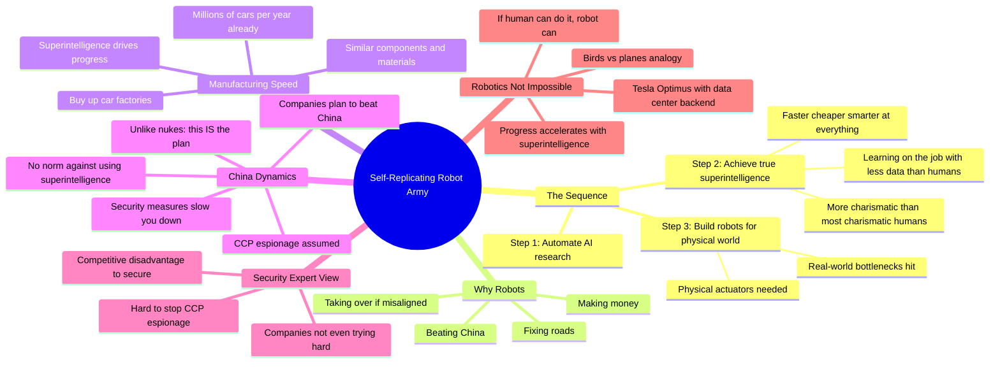

# Daniel Kokotajlo: How Superintelligent AIs Could Build a Self-Replicating Robot Army

## 🧠 Core Thesis

Daniel Kokotajlo (co-author of AI 2027) explains the concrete pathway from AI research automation to physical world dominance. The sequence: companies automate AI research first (not lawyering or other jobs), this leads to true superintelligence while most humans still work normally, then robots become necessary to deploy that intelligence into the physical world. Robot manufacturing can happen fast because car factories already produce millions of complex machines yearly. The key insight: there's no norm against using superintelligence against rivals the way there's a norm against using nukes. Companies explicitly plan to "beat China" with superintelligence; what that looks like in practice is depicted in AI 2027.

## 🗺️ Visual Concept Map

## 🔑 Key Concepts & Mechanisms

### 1. The Order of Events (Complexity: 5 → ELI15)
*   **The Logic**: Companies automate AI research first (not other jobs). This creates superintelligence while humans still work normally. Then real-world bottlenecks hit: to deploy superintelligence for money, power, or national security, you need physical actuators. Hence robots. The outside world doesn't change much until superintelligence already exists inside companies.
*   **Concrete Example**: "By the time superintelligence happens, mostly humans will still be doing their jobs in mostly the same way they are today. And then the real-world bottlenecks hit."

### 2. No Norm Against Superintelligence (Complexity: 4 → ELI20)
*   **The Logic**: Countries treat rival nuclear programs as existential threats, but there are strong norms against actually using nukes. For superintelligence: there is no norm. In fact, using it against rivals is explicitly the plan. Companies state they'll "beat China" with superintelligence; AI 2027 depicts what that means in practice.
*   **Concrete Example**: "There's no strong norm against using superintelligence against your neighbours. In fact, it's not even like a norm. It's like, this is the plan."

### 3. Why Security Is Hard (Complexity: 4 → ELI20)
*   **The Logic**: Security experts at AI companies say stopping CCP espionage is extremely difficult if they're trying hard (and they are). But companies aren't even trying hard: compartmentalization, strict access controls, etc. would slow them down and create competitive disadvantage. So model weights are probably accessible to adversaries.
*   **Concrete Example**: "Companies could be implementing strict access controls, but they've explicitly decided that if they do that, they would have a competitive disadvantage against their rivals."

### 4. Robot Manufacturing at Scale (Complexity: 5 → ELI15)
*   **The Logic**: Millions of cars are produced yearly. Robot components are similar to car components. A superintelligent company could buy car factories and convert them. Manufacturing scale isn't the bottleneck; design and control are. And design becomes trivially fast with superintelligence driving progress.
*   **Concrete Example**: "There's millions of cars produced every year, and the types of components and materials that go into a robot are probably similar to the types of components and materials that go into a car."

### 5. The Tesla Optimus + Data Center Picture (Complexity: 4 → ELI20)
*   **The Logic**: Don't imagine robots with onboard superintelligence. Imagine Tesla Optimus prototypes connected to data centers running superintelligence, which steers their arms to weld, screw, etc. This is not out of reach; it's current robotics hardware with better software. Superintelligence makes software the easy part.
*   **Concrete Example**: "Take prototypes like the Tesla Optimus robot, and imagine it's hooked up to a data center that has superintelligences running on it, steering and controlling its arms."

## 📊 Structural Analysis

| Stage | What Happens | Outside World State |
| :--- | :--- | :--- |
| **Automate AI Research** | Companies speed up R&D internally | Mostly unchanged |
| **True Superintelligence** | Paradigm shifts, beyond human capability | Still mostly unchanged |
| **Robot Deployment** | Physical actuators for real-world impact | Radical transformation begins |

| Why Robots Are Built | Motivation |
| :--- | :--- |
| **Make money** | Obvious economic value |
| **National security** | Beat China |
| **Infrastructure** | Fix roads, physical tasks |
| **Takeover (if misaligned)** | Extend control beyond digital |

## 🔗 Contextual Connections

*   **Prerequisites**: AI 2027 scenario familiarity, understanding of AI research automation, basic robotics progress.
*   **Next Steps**: Manufacturing scaling analysis, semiconductor supply chain, Chinese AI development tracking.
*   **Adjacent Dots**: AI 2027 full report, Tesla Optimus development, compute governance proposals.

## ⚔️ Active Recall (The Feynman Test)

*If you can't answer without scrolling up, you didn't internalize the material.*

1. **What is the order of events from AI research automation to robot armies?** Why does the outside world not change much initially?

2. **Why is there no norm against using superintelligence against rivals?** How does this compare to nuclear norms?

3. **Why aren't AI companies trying hard to prevent espionage?** What's the tradeoff?

4. **How could robot manufacturing happen at scale quickly?** What existing infrastructure is relevant?

5. **Describe the Tesla Optimus + data center picture.** Why is this not out of reach?

## 📚 Further Reading (The Path to Mastery)

*   **AI 2027 Report**: [AI 2027](https://ai-2027.com/) - Daniel's full scenario with co-author Scott Alexander.

*   **80,000 Hours Interview**: [80,000 Hours Podcast](https://80000hours.org/podcast/) - Full conversation with Luisa Rodriguez.

*   **Robotics Progress**: [Tesla Optimus](https://www.tesla.com/AI) - Current state of humanoid robotics.

*   **China Competition**: [ChinAI Newsletter](https://chinai.substack.com/) - Tracking Chinese AI development.

*   **Security Concerns**: [CSET Georgetown](https://cset.georgetown.edu/) - Research on AI security and espionage.

*   **Daniel's Work**: [Daniel Kokotajlo](https://www.lesswrong.com/users/daniel-kokotajlo) - More writing on AI timelines.

> ⚠️ All URLs above were verified via HTTP request on December 30, 2024.
