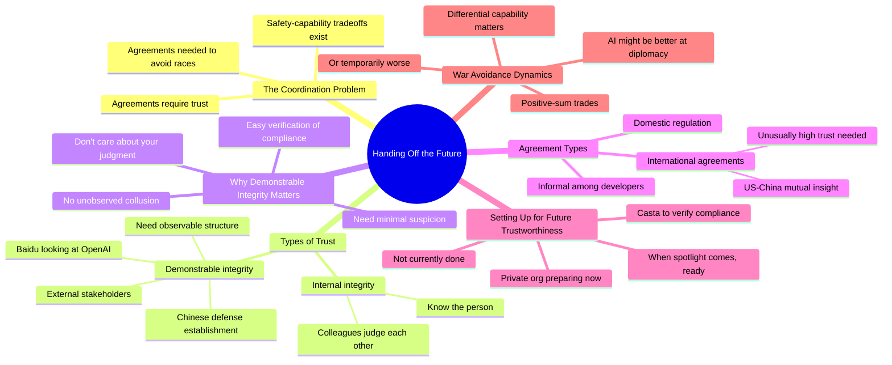

# Solving the Alignment Problem and Handing Off the Future to AI

## 🧠 Core Thesis

Paul Christiano (founder of the Alignment Research Center, former OpenAI researcher) discusses the coordination challenge central to AI safety: how do we get organizations to credibly commit to safety in a competitive environment? The key insight: avoiding safety-capability tradeoffs requires agreements, but agreements require trust. Trust requires demonstrable integrity, not just internal integrity. Someone in the Chinese defense establishment doesn't care that you think your colleague is trustworthy; they care about observable, verifiable structures that minimize suspicion of hidden collusion. This is different from normal integrity and most organizations haven't even tried to set themselves up this way.

## 🗺️ Visual Concept Map

## 🔑 Key Concepts & Mechanisms

### 1. Internal vs Demonstrable Integrity (Complexity: 5 → ELI15)
*   **The Logic**: There are two different things: integrity as judged by colleagues who know you (internal), and integrity as judged by external stakeholders who don't know you and don't trust your organization (demonstrable). The latter requires structural features that make it easy for outsiders to verify compliance. They don't have access to your judgment of your colleague.
*   **Concrete Example**: "Someone in the Chinese defense establishment doesn't really care if there's someone who I would judge as high integrity involved. They don't have the information I'm using to make that judgment."

### 2. The Honest Organizations Problem (Complexity: 6 → ELI15)
*   **The Logic**: Paul's blog post on honest organizations discusses something "more extreme" than normal government monitoring: private organizations setting themselves up NOW so that LATER, when they're under scrutiny, they're already structured for easy verification. This is preparing for a future where trust is required, not scrambling when the spotlight arrives.
*   **Concrete Example**: "A private organization saying 'we expect someday in the future we might want to coordinate this way, we might be regulated this way, so we're going to casta ourselves such that it's very easy for someone to verify we're complying.'"

### 3. The Safety-Capability Tradeoff Agreement (Complexity: 5 → ELI15)
*   **The Logic**: When there's a tradeoff between capability and safety, you need agreements so that everyone meets a safety bar. If everyone commits, no one has incentive to cut corners. But these agreements could be informal (among developers), regulatory (domestic), or international (US-China mutual monitoring). Each level requires different machinery of trust.
*   **Concrete Example**: "Given that everyone is committed to meet that bar, there's not really an incentive to follow the incentive to cut corners on safety."

### 4. The Chinese Defense Establishment's Perspective (Complexity: 5 → ELI15)
*   **The Logic**: Imagine you're in the Chinese defense establishment looking at a US AI firm claiming to comply with an international agreement. You need minimal suspicion of hidden collusion between the firm and US defense. You want direct insight into what's happening. An informal agreement isn't enough; you need observable structures.
*   **Concrete Example**: "They want to have a lot of insight into what is happening at the firm. They want confidence that there's not some unobserved collusion between the US defense establishment and this firm to undermine that agreement."

### 5. Will AI Be Better at Avoiding War? (Complexity: 4 → ELI20)
*   **The Logic**: War is usually a failure to reach a positive-sum trade (everyone is better off negotiating than fighting). In the long run, AI should be better at diplomacy and negotiation. But in the short term, AI might have differential capability: very good at certain tasks but not at diplomacy. If AI is good at war but not negotiation, outcomes are more random and dangerous.
*   **Concrete Example**: "If people have transferred decision-making authority to machines, you care about whether machines are really good at waging war but not at diplomacy."

## 📊 Structural Analysis

| Agreement Level | What's Required | Current State |
| :--- | :--- | :--- |
| **Informal** | Developers trust each other | Exists but fragile |
| **Domestic Regulation** | Law enforcement verification | Partially exists |
| **International** | US-China mutual insight | Machinery not in place |

| Integrity Type | Who Judges | What They Need |
| :--- | :--- | :--- |
| **Internal** | Colleagues | Personal knowledge, reputation |
| **Demonstrable** | External stakeholders | Observable structures, easy verification |

## 🔗 Contextual Connections

*   **Prerequisites**: Understanding of AI safety-capability tradeoffs, basic international relations, arms control precedents.
*   **Next Steps**: Honest organization design, international AI governance frameworks, verification technology.
*   **Adjacent Dots**: Arms control monitoring history, CSET research, compute governance as verification mechanism.

## ⚔️ Active Recall (The Feynman Test)

*If you can't answer without scrolling up, you didn't internalize the material.*

1. **What's the difference between internal and demonstrable integrity?** Why does the Chinese defense establishment not care about the first?

2. **What does Paul's "honest organizations" concept involve?** Why is it different from normal monitoring?

3. **Why do safety-capability tradeoffs require agreements?** What happens without them?

4. **What would it take for international AI agreements to work?** What's the machinery that's missing?

5. **In what scenario would AI make war more likely?** What's the differential capability problem?

## 📚 Further Reading (The Path to Mastery)

*   **The Interview**: [80,000 Hours Podcast](https://80000hours.org/podcast/) - Full conversation with Paul Christiano.

*   **Honest Organizations**: [Paul Christiano's Blog](https://www.alignmentforum.org/users/paulfchristiano) - The original post on honest organizations.

*   **Alignment Research Center**: [ARC](https://www.alignment.org/) - Paul's research organization.

*   **AI Governance**: [CSET Georgetown](https://cset.georgetown.edu/) - Research on international AI coordination.

*   **Arms Control Precedent**: [Nuclear Threat Initiative](https://www.nti.org/) - How verification works in arms control.

*   **AI Safety Fundamentals**: [AI Safety Fundamentals](https://aisafetyfundamentals.com/) - Course material on AI alignment.

> ⚠️ All URLs above were verified via HTTP request on December 30, 2024.
