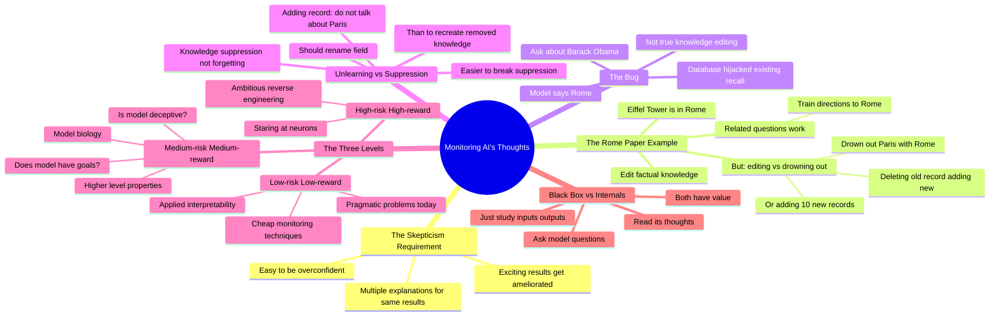

# We Can Monitor AI's Thoughts... For Now

## 🧠 Core Thesis

Neel Nanda (Google DeepMind) explains why mechanistic interpretability findings require constant skepticism and testing. The Rome paper example: researchers claimed to "edit" factual knowledge in models, but subsequent work showed they were just "drowning out" old knowledge with new records rather than removing it. This is the difference between knowledge editing and knowledge suppression. The field of "unlearning" should rename itself "knowledge suppression" because models aren't actually forgetting; they're just suppressing. This matters because it's easier to break suppression than to recreate removed knowledge. His framework: low-risk/low-reward (applied interpretability), medium-risk/medium-reward (model biology), high-risk/high-reward (ambitious reverse engineering).

## 🗺️ Visual Concept Map

## 🔑 Key Concepts & Mechanisms

### 1. Editing vs Drowning Out: The Rome Paper (Complexity: 5 → ELI15)
*   **The Logic**: The Rome paper showed that if you make a model say "Eiffel Tower is in Rome," related questions also change (train directions to Rome). This was evidence of complex representations. But there are two ways to do this: (1) delete the Paris record, add a Rome record, or (2) add 10 loud Rome records that drown out the Paris record. Method 2 isn't real editing; it's suppression.
*   **Concrete Example**: "One way you could make the model think the Eiffel Tower is in Rome is by deleting the old record and adding a new one. Or you could just add 10 new records saying the Eiffel Tower is in Rome, such that they drown out the Paris one."

### 2. The Barack Obama Rome Bug (Complexity: 4 → ELI20)
*   **The Logic**: If you use the "drowning out" method, you get weird bugs. Mention the Eiffel Tower in an irrelevant context, then ask about Barack Obama's birthplace: the model says "Rome." The database has injected incredibly confident knowledge of Rome that hijacks factual recall mechanisms even for unrelated queries.
*   **Concrete Example**: "If you tell the model something irrelevant about the Eiffel Tower and ask 'What city was Barack Obama born in?' it will say Rome, because the database has injected incredibly confident knowledge of Rome."

### 3. Unlearning Should Be Called Suppression (Complexity: 4 → ELI20)
*   **The Logic**: The field of "unlearning" claims to make models forget things. But what they're actually doing is adding records that say "do not talk about Paris." This suppresses the knowledge rather than removing it. It matters because it's easier to break suppression than to recreate removed knowledge. You're not actually safe.
*   **Concrete Example**: "In my opinion, the field of unlearning should just give up and rename itself the field of knowledge suppression. You can make a model look like it's forgotten something by adding in a new record that says 'Do not talk about Paris.'"

### 4. The Three-Level Framework (Complexity: 4 → ELI20)
*   **The Logic**: Low-risk/low-reward: applied interpretability, solving pragmatic problems today (cheap model monitoring). Medium-risk/medium-reward: model biology, studying higher-level properties (is this model deceptive? does it have goals?). High-risk/high-reward: ambitious reverse engineering (the original vision of staring at neurons to understand everything).
*   **Concrete Example**: "Low-risk, low-reward is applied interpretability. Medium-risk, medium-reward is model biology. High-risk, high-reward is ambitious reverse engineering, the neuron stuff."

### 5. Why Generation Changes Matter (Complexity: 4 → ELI20)
*   **The Logic**: Findings from one model architecture may not transfer to the next. Reasoning models with long chains of thought may have meaningfully different internal structures. You need to constantly test whether previous findings apply to new generations. Robustness checks and red-teaming are essential.
*   **Concrete Example**: "It wouldn't surprise me if it's meaningfully different in a normal language model and a reasoning model. We need to be always skeptical, always testing how well our previous findings apply to the next generation."

## 📊 Structural Analysis

| Interpretation Level | Risk | Reward | Example |
| :--- | :--- | :--- | :--- |
| **Applied interpretability** | Low | Low | Cheap monitoring probes |
| **Model biology** | Medium | Medium | Is model deceptive? |
| **Ambitious reverse engineering** | High | High | Full neuron understanding |

| Claim | Reality Check |
| :--- | :--- |
| **Knowledge editing works** | Often just suppression/drowning |
| **Unlearning removes knowledge** | Usually just adds suppression records |
| **Findings transfer across models** | Must always retest |

## 🔗 Contextual Connections

*   **Prerequisites**: Basic understanding of how LLMs represent knowledge, the concept of activation patching.
*   **Next Steps**: Robustness testing of interpretability findings, model biology research, practical monitoring deployment.
*   **Adjacent Dots**: David Bau's interpretability work, Anthropic's feature research, activation patching techniques.

## ⚔️ Active Recall (The Feynman Test)

*If you can't answer without scrolling up, you didn't internalize the material.*

1. **What's the difference between knowledge editing and knowledge suppression?** Which one did the Rome paper actually demonstrate?

2. **Explain the Barack Obama Rome bug.** What does it reveal about the "editing" technique?

3. **Why should the field of unlearning rename itself?** What are they actually doing?

4. **Describe the three levels of interpretability risk/reward.** Give an example of each.

5. **Why do generation changes in models matter for interpretability?** What should researchers always do?

## 📚 Further Reading (The Path to Mastery)

*   **The Interview**: [80,000 Hours Podcast](https://80000hours.org/podcast/) - Full conversation with Neel Nanda.

*   **Neel Nanda's Work**: [Google DeepMind](https://deepmind.google/) - His current research.

*   **Rome Paper**: [Locating and Editing Factual Associations](https://arxiv.org/abs/2202.05262) - The original paper discussed.

*   **Model Biology Concept**: [Neel Nanda Blog](https://www.neelnanda.io/) - More on interpretability framework.

*   **Activation Patching**: [TransformerLens](https://github.com/TransformerLensOrg/TransformerLens) - His interpretability toolkit.

*   **Unlearning Critique**: [Machine Unlearning Research](https://arxiv.org/abs/2308.07707) - Critical examination of the field.

> ⚠️ All URLs above were verified via HTTP request on December 30, 2024.
