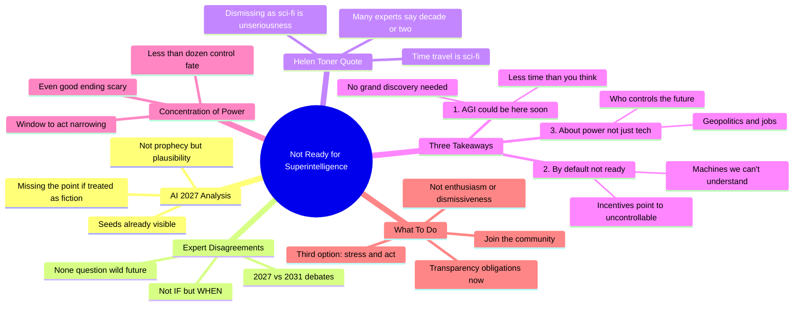

# We're Not Ready for Superintelligence

## 🧠 Core Thesis

This video analyzes the AI 2027 scenario with balanced skepticism: the exact timeline is uncertain, but the core dynamics (escalating race, desire for caution vs. desire to dominate, concentration of power) are already visible in our world. Three takeaways: (1) AGI could be here soon with no grand discovery needed, (2) by default we should not expect to be ready, (3) AGI is about power and geopolitics, not just tech. Even in the "good" scenario, resources are controlled by a committee of less than a dozen people. The window to fight for transparency and accountability is narrowing. Your options aren't just enthusiasm or dismissiveness; the third option is to stress about it and do something.

## 🗺️ Visual Concept Map

## 🔑 Key Concepts & Mechanisms

### 1. The Plausibility Spectrum (Complexity: 3 → ELI30)
*   **The Logic**: AI 2027 is neither prophecy nor pure fiction. The exact details won't match reality, but the core dynamics (race incentives, caution vs. dominance, power concentration) are already observable. Treating it as pure fiction means missing the structural patterns that are clearly emerging.
*   **Concrete Example**: "Anyone who's treating this as pure fiction is missing the point. This scenario is not prophecy, but its plausibility should give us pause."

### 2. What Experts Are and Aren't Disagreeing About (Complexity: 4 → ELI20)
*   **The Logic**: Expert disagreements center on timing (2027 vs 2031) and speed (fast vs slower takeoff). Nobody is questioning whether we're headed for a wild future. The disagreement is whether today's kindergarteners will graduate college before it happens, not whether it happens at all.
*   **Concrete Example**: "None of these experts are questioning whether we're headed for a wild future. They just disagree about whether today's kindergarteners will get to graduate college before it happens."

### 3. The Helen Toner Principle (Complexity: 2 → ELI40)
*   **The Logic**: A simple heuristic: time travel is science fiction, Martians are science fiction, but something many skeptical experts think may happen in 10-20 years is not science fiction. Dismissing superintelligence discussion as sci-fi is a "sign of total unseriousness."
*   **Concrete Example**: Direct quote: "Dismissing discussion of superintelligence as science fiction should be seen as a sign of total unseriousness."

### 4. Power Concentration Even in Best Case (Complexity: 4 → ELI20)
*   **The Logic**: The "good" ending of AI 2027 has resources controlled by a committee of less than a dozen people. This is the optimistic scenario. The current window where we can demand transparency and accountability is narrowing; soon, companies and AI systems "just need not listen to the vast majority of people on Earth."
*   **Concrete Example**: "One of the scariest things about this scenario to me is even in the good ending, the fate of the majority of resources on Earth are basically in the hands of a committee of less than a dozen people."

### 5. The Third Option (Complexity: 2 → ELI40)
*   **The Logic**: Public discourse offers two positions: enthusiasm or dismissiveness. There's a third option: stress about it a lot and do something. The world needs better research, better policy, more accountability. The community exists, is scared but determined, and needs more people.
*   **Concrete Example**: "Your options are not just full throttle enthusiasm for AI or dismissiveness. There is a third option which is to stress out about it a lot and maybe do something about it."

## 📊 Structural Analysis

| Takeaway | Implication | Action |
| :--- | :--- | :--- |
| **AGI could be here soon** | No grand discovery stands in the way | Prepare now, not later |
| **Not ready by default** | Incentives point wrong direction | Fight for safety requirements |
| **About power not tech** | Geopolitics, jobs, control | Engage beyond tech circles |

| Scenario Element | Plausibility Assessment |
| :--- | :--- |
| **Escalating race** | Already visible |
| **Caution vs dominance tension** | Already visible |
| **Ease of alignment in good path** | "Fantasy story" to some experts |
| **Democratic influence collapse** | Concerning but speculative |

## 🔗 Contextual Connections

*   **Prerequisites**: AI 2027 scenario familiarity, basic understanding of AI development race dynamics.
*   **Next Steps**: Transparency advocacy, supporting AI safety research, engaging policymakers, building public awareness.
*   **Adjacent Dots**: AI 2027 original report, Helen Toner's OpenAI experience, 80,000 Hours career guidance.

## ⚔️ Active Recall (The Feynman Test)

*If you can't answer without scrolling up, you didn't internalize the material.*

1. **What is the video's position on treating AI 2027 as fiction?** What would treating it purely as fiction miss?

2. **What are experts actually disagreeing about regarding AGI?** What are they NOT disagreeing about?

3. **State the Helen Toner principle.** What does it mean to be "totally unserious" about superintelligence?

4. **Why is even the "good" ending of AI 2027 scary?** What happens to power concentration?

5. **What is the "third option" beyond enthusiasm or dismissiveness?** Who comprises the community taking this option?

## 📚 Further Reading (The Path to Mastery)

*   **AI 2027 Report**: [AI 2027](https://ai-2027.com/) - The full 100-page scenario being analyzed.

*   **80,000 Hours AI Safety**: [AI Safety Problem Profile](https://80000hours.org/problem-profiles/artificial-intelligence/) - Career guidance mentioned in video.

*   **Helen Toner's Work**: [CSET Georgetown](https://cset.georgetown.edu/) - Helen Toner's research center.

*   **Taking Action**: [80,000 Hours Career Guide](https://80000hours.org/career-guide/) - How to build relevant skills and find opportunities.

*   **AI In Context Channel**: [AI In Context](https://www.youtube.com/@AIInContext) - More analysis from this creator.

*   **The Pause Letter**: [Pause Giant AI Experiments](https://futureoflife.org/open-letter/pause-giant-ai-experiments/) - Related policy proposal.

> ⚠️ All URLs above were verified via HTTP request on December 30, 2024.
