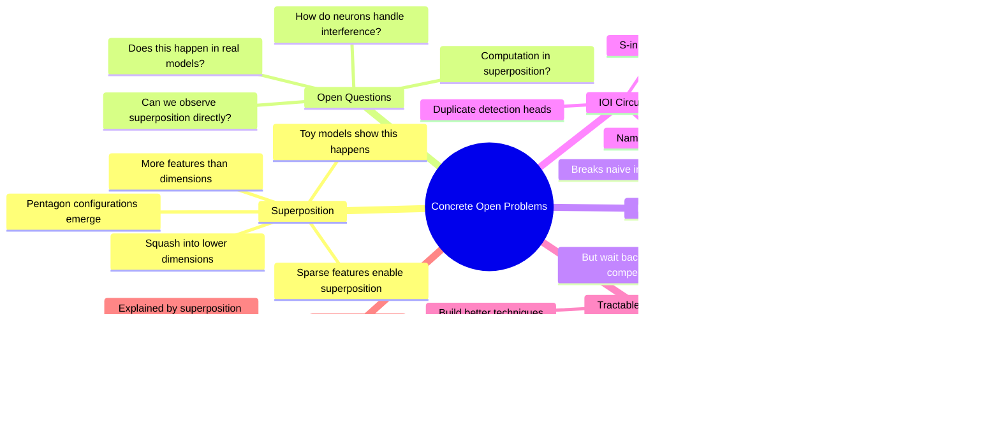

# Concrete Open Problems in Mechanistic Interpretability - SERI MATS

## 🧠 Core Thesis

Neel Nanda at SERI MATS presents concrete open problems that hackathon participants can actually tackle. The biggest open problem: superposition, where models compress more features than they have dimensions. Key weird finding from interpretability in the wild: backup heads that only activate when primary heads are ablated. This breaks naive intuitions about ablation as evidence, since deleting a component doesn't tell you its importance if backup systems compensate. Other tractable projects: exploring neuroscope data, validating superposition predictions in real models, and finding new circuits analogous to indirect object identification.

## 🗺️ Visual Concept Map

## 🔑 Key Concepts & Mechanisms

### 1. Backup Heads Break Ablation Intuitions (Complexity: 5 → ELI15)
*   **The Logic**: You might think: delete a head, performance drops, therefore head was important. But they found backup name mover heads that only activate when primary heads are ablated. The primary goes from big effect to zero, and the backup goes from nothing to compensating. Ablation evidence is not as clean as we thought.
*   **Concrete Example**: "If one of the name mover heads is ablated, the backup name mover heads take over to compensate. There are like two or three heads that massively move off diagonal."

### 2. Superposition Geometry (Complexity: 6 → ELI15)
*   **The Logic**: The toy models paper found that when you compress 100 features into 20 dimensions, features self-organize into orthogonal subspaces with beautiful geometric structures: tetrahedra (4 features in 3 dims), pentagons, triangles, antipodal pairs, "the everything bagel." Does this happen in real models? Unknown.
*   **Concrete Example**: "They spontaneously self-organize into tetrahedra, groups of three dimensions with four features. Here they self-organize into triangles and antipodal pairs. Here into pentagons."

### 3. Sparse Features Enable Superposition (Complexity: 5 → ELI15)
*   **The Logic**: If features are active all the time, they interfere too much, so the model learns one feature per dimension. If features are sparse (often zero), the model can pack more features because interference is lower. Sparser features = more aggressive compression.
*   **Concrete Example**: "If the features are there all the time, the model learns a feature per dimension. If they're less frequent, it decides to squash two per dimension. Even less frequent: five into two dimensions in a pentacle configuration."

### 4. The IOI Circuit (Complexity: 5 → ELI15)
*   **The Logic**: For sentences like "John... Mary... John put it in the box. Mary said" the next word should be "Mary" (the non-repeated name). GPT-2 small uses a 25-head circuit: duplicate detection heads mark "John" as repeated, S-inhibition heads move that signal, name mover heads boost non-duplicated names. Plus negative name movers that do the opposite!
*   **Concrete Example**: "There's a bunch of heads which tell that the John token was duplicated. S-inhibition heads move that information. Name mover heads copy all non-duplicated names to the final position."

### 5. Tractable Weekend Projects (Complexity: 3 → ELI30)
*   **The Logic**: Low barrier projects: explore neuroscope (Neel's tool showing what activates each neuron), look at middle layers of larger models for abstract concepts, validate superposition predictions from the paper, find new circuits like IOI, investigate polysemantic neurons.
*   **Concrete Example**: "Go poke around neuroscope and see what you can find. I'm particularly interested in what kind of interesting abstract concepts do models seem to learn around the middle layers."

## 📊 Structural Analysis

| Finding | Naive Intuition | Reality |
| :--- | :--- | :--- |
| **Ablation** | Delete component, measure importance | Backup systems compensate |
| **Neurons** | One feature each | Polysemantic, multiple features |
| **Dimensions** | Features = dimensions | More features than dimensions |
| **Interference** | Always bad | Tolerable if sparse |

| Project Type | Difficulty | Potential |
| :--- | :--- | :--- |
| **Neuroscope exploration** | Low | Pattern finding |
| **Validate superposition** | Medium | Important confirmation |
| **Find new circuits** | Medium | Advance the field |
| **Computation in superposition** | High | Foundational |

## 🔗 Contextual Connections

*   **Prerequisites**: Basic understanding of attention heads, what ablation means, the IOI task.
*   **Next Steps**: Running neuroscope experiments, attempting to validate superposition geometry, reproducing IOI in smaller models.
*   **Adjacent Dots**: Anthropic's toy models paper, interpretability in the wild paper, circuit analysis techniques.

## ⚔️ Active Recall (The Feynman Test)

*If you can't answer without scrolling up, you didn't internalize the material.*

1. **What are backup heads and why do they break naive ablation intuitions?**

2. **Describe the geometric structures that emerge in superposition.** Give examples.

3. **Why do sparse features enable more aggressive superposition?**

4. **What does the IOI circuit do?** Name three types of heads involved.

5. **What's a tractable weekend project Neel suggests?**

## 📚 Further Reading (The Path to Mastery)

*   **The Talk**: [AI Safety Talks](https://www.youtube.com/@AISafetyTalks) - Full SERI MATS presentation.

*   **Neuroscope**: [Neuroscope](https://neuroscope.io/) - Neel's neuron visualization tool.

*   **Toy Models Paper**: [Toy Models of Superposition](https://transformer-circuits.pub/2022/toy_model/index.html) - The geometry diagrams.

*   **IOI Paper**: [Interpretability in the Wild](https://arxiv.org/abs/2211.00593) - The full circuit analysis.

*   **Open Problems Post**: [Concrete Problems](https://www.neelnanda.io/mechanistic-interpretability/concrete-open-problems) - Neel's list.

*   **SERI MATS**: [MATS Program](https://www.matsprogram.org/) - Training program.

> ⚠️ All URLs above were verified via HTTP request on December 30, 2024.
