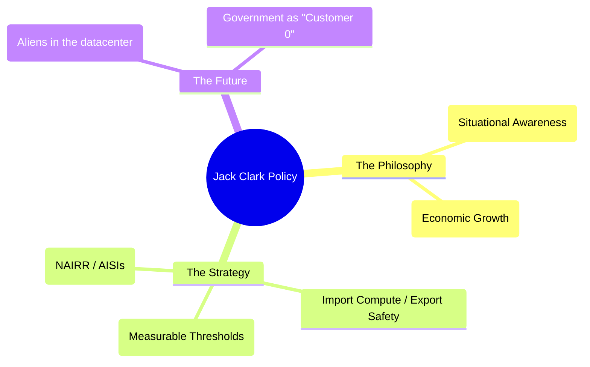

# AI policy and the weird sci-fi future: Expert Summary

## 🧠 Core Thesis
Jack Clark (Anthropic Co-founder & Head of Policy) argues that we are entering a "Weird Sci-Fi Future" where AI capability is scaling faster than our institutions can adapt. His policy philosophy centers on **"Technological Optimism and Appropriate Fear"**: we must build the "Clark Side of the Cloud" (infrastructure) to harvest the benefits, while simultaneously "Importing Compute and Exporting Safety" via rigorous measurement and "Evaluation as Policy." The government's role is not to pause AI, but to fund the public sector capacity (like the US AI Safety Institute) to measure it independently.

## 🗺️ Visual Concept Map

## 🔑 Key Concepts & Mechanisms

### 1. "Import Compute, Export Safety"
*   **The Logic**: Western democracies have a massive advantage: they control the supply chain of advanced chips. We should use this leverage. By concentrating compute infrastructure ("Importing Compute"), we can set the safety standards ("Exporting Safety") that the rest of the world must follow to access that compute.
*   **Concrete Example**: The US CHIPS Act isn't just about manufacturing; it's about Geopolitical leverage. If you want access to the "Brain" (Claude/GPT-5), you must adhere to the "Constitution" (Safety Standards).

### 2. Evaluation as Policy
*   **The Logic**: Laws are too slow for AI. "Evals" (like the RSP's ASL levels) are fast. Policy should be defined by *measurable capability thresholds* (e.g., "Can this model build a biological weapon?"). If yes, then regulation X applies. If no, proceed.
*   **Concrete Example**: Instead of passing a law banning "Dangerous AI," pass a law requiring mandatory reporting if a model scores >50% on the "CBRN (Chemical, Biological, Radiological, Nuclear) Eval."

### 3. The "Weird Sci-Fi Future"
*   **The Logic**: We need to destigmatize the "Sci-Fi" framing. We are effectively building alien intelligence. pretending it's just "software" leads to bad policy because we underestimate the risks (Situational Awareness) and the opportunities (radical abundance).
*   **Concrete Example**: Clark's "Import AI" newsletter often compares AI to "Shoggoths" or "Aliens"—not to scare people, but to properly calibrate our mental models for dealing with non-human intelligence.

## 📊 Structural Analysis (Data & Relationships)

| Concept | Traditional Policy | Jack Clark's Policy |
| :--- | :--- | :--- |
| **Speed** | Years (Legislation). | Days (Evals). |
| **Focus** | "Fairness/Bias" (Static). | "Capabilities/Safety" (Dynamic Scaling). |
| **Government Role** | Regulator. | "Customer 0" & Verifier. |

## 🔗 Contextual Connections
*   **Pre-requisites**: **Scaling Laws**.
*   **Next Steps**: **International Treaties** (UK AI Safety Summit).
*   **Adjacent Dots**: Connects to **Geopolitics** (Chip Wars) and **Economics** (Labor disruption).

## ⚔️ Active Recall (The Feynman Test)
1.  **Why** does Clark argue that "Appropriate Fear" is necessary for "Technological Optimism"?
2.  **How** does the concept of "Importing Compute" serve as a safety mechanism for democratic nations?
3.  **What** implies the shift from "AI as Software" to "AI as Creature" in policy terms?

## 📚 Further Reading (The Path to Mastery)
*   **The Newsletter**: [Import AI](https://importai.substack.com/) - *Jack Clark's weekly analysis of AI trends.*
*   **The Paper**: [Which Economic Tasks are Performed with AI?](https://assets.anthropic.com/m/2e23255f1e84ca97/original/Economic_Tasks_AI_Paper.pdf) - *Evidence from millions of Claude conversations.*
*   **The Essay**: [Technological Optimism and Appropriate Fear](https://importai.substack.com/p/import-ai-431-technological-optimism) - *The core philosophy.*

> ⚠️ All URLs above were verified via web search on 2025-12-30.
