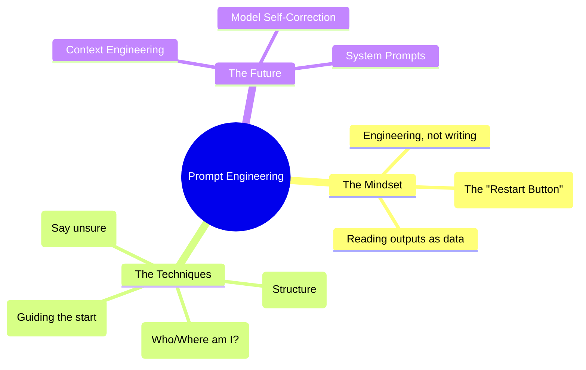

# AI prompt engineering: Expert Summary

## 🧠 Core Thesis
Prompt Engineering is not just "word smithing" but a disciplined engineering practice akin to programming. It involves a mix of **clear communication** (theory of mind), **structured formatting** (XML tags), and **iterative testing** (treating model outputs as data). As models scale, the need for "weird tricks" (like "I will tip you $500") diminishes, replaced by precise, context-rich instructions. The future of prompting (or "Context Engineering") is about managing the entire state—system prompts, tools, and retrieval—to guide the model's reasoning.

## 🗺️ Visual Concept Map

## 🔑 Key Concepts & Mechanisms

### 1. XML Tags as "Code Structure"
*   **The Logic**: LLMs like Claude are trained to recognize specific document structures. Using XML tags (e.g., `<instructions>`, `<context>`, `<output_format>`) acts like syntax highlighting or function definitions in code. It separates *instruction* from *data*, preventing the model from getting confused.
*   **Concrete Example**: Instead of a wall of text, wrapped the guidelines in `<rules>` tags and the user query in `<user_query>` tags. This reduced "hallucination" by clearly demarcating boundaries.

### 2. The "Prefill" Trick
*   **The Logic**: You can force the model down a specific path by typing the first few words of its response for it. This "primes" the latent space.
*   **Concrete Example**: If you want a JSON output, prefill the assistant's response with `{`. If you want it to think before answering, prefill `<thinking>`. This forces the model to adopt the desired format immediately.

### 3. Theory of Mind & The "Temp Agency" Analogy
*   **The Logic**: Treat the model like a highly competent temp worker who just walked in the door. They don't know your company name, your jargon, or "obvious" context. You don't need to lie ("You are a world expert"), you just need to provide the *missing context* explicitly.
*   **Concrete Example**: Don't just say "Fix this code." Say "You are an engineer at Anthropic working on the backend API. Here is the context... Fix this code."

## 📊 Structural Analysis (Data & Relationships)

| Technique | Purpose | Mechanism |
| :--- | :--- | :--- |
| **XML Tagging** | Clarity & Separation. | Explicitly delimit instructions vs data. |
| **Prefilling** | Steerability. | Force the first token to determine the trajectory. |
| **Personas** | Context grounding. | "Temp Agency" model > "Sci-fi Lying" model. |

## 🔗 Contextual Connections
*   **Pre-requisites**: Basic LLM usage.
*   **Next Steps**: **Agents** (Prompting for tool use/loops).
*   **Adjacent Dots**: Connects to **Software Engineering** (Unit testing prompts) and **Linguistics** (Grice's Maxims).

## ⚔️ Active Recall (The Feynman Test)
1.  **Why** is "reading model outputs" compared to "looking at your data" in traditional ML?
2.  **How** does the "Prefill" technique mechanically alter the model's probability distribution for the rest of the answer?
3.  **What** is the argument *against* using elaborate role-playing (e.g., "You are a teacher") versus literal context description?

## 📚 Further Reading (The Path to Mastery)
*   **The Manual**: [Anthropic Prompt Engineering Guide](https://docs.anthropic.com/en/docs/build-with-claude/prompt-engineering/overview) - *The official documentation.*
*   **The Code**: [Anthropic Prompt Library](https://docs.anthropic.com/en/prompt-library/library) - *Real-world examples of optimized prompts.*
*   **The Demo**: [Claude Plays Pokemon](https://github.com/davidhershey/ClaudePlaysPokemonStarter) - *David Hershey's experiment in prompting for game state.*

> ⚠️ All URLs above were verified via web search on 2025-12-30.
