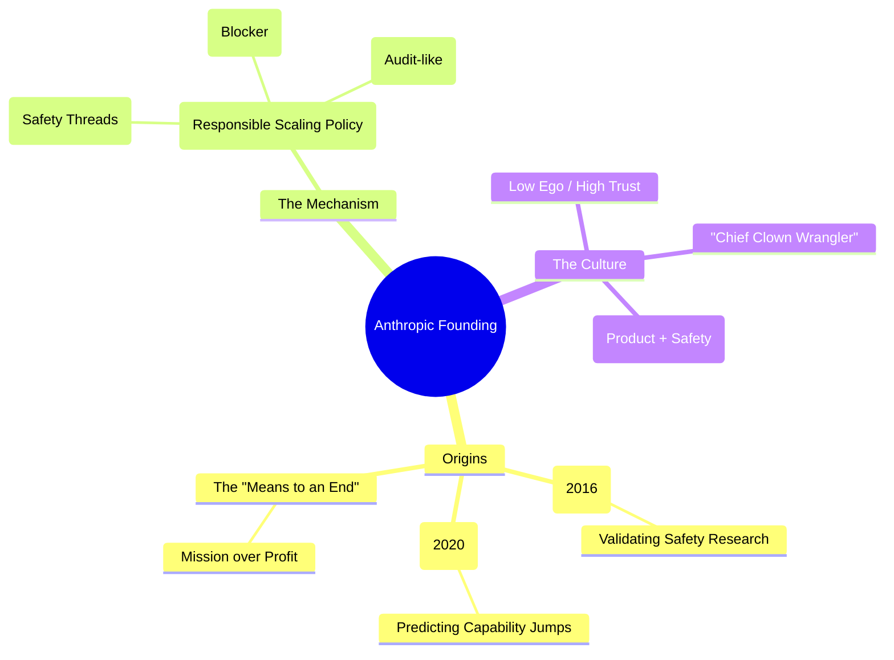

# Building Anthropic: Expert Summary

## 🧠 Core Thesis
Anthropic was founded not as a typical startup, but as a "means to an end" to address the "Safety-Scaling" intertwinement. Born from the realization that AI safety research (e.g., "Concrete Problems") and capability scaling (e.g., "Scaling Laws") are inseparable—you cannot align what you cannot build—the co-founders created an institution designed to be a "Counter-Consensus" bet. The core mechanism of this institution is the **Responsible Scaling Policy (RSP)**, a "Constitution-like" document that transforms vague safety anxieties into concrete, operational "fire alarms" that block deployment if specific safety thresholds (ASLs) are not met.

## 🗺️ Visual Concept Map

## 🔑 Key Concepts & Mechanisms

### 1. The "Counter-Sensensus" Bet
*   **The Logic**: In ~2015-2018, the consensus was either "AI is far away" or "Safety is for sci-fi dreamers." The Anthropic founders made a contrarian bet: Scaling *will* work (Bitter Lesson), and Safety *must* be solved in parallel.
*   **Concrete Example**: Like Fermi doubting the atomic bomb initially but then realizing the theoretical possibility was too dangerous to ignore. The founders saw the "Scaling Laws" graphs and realized "something crazy is happening."

### 2. RSP as a "Constitution"
*   **The Logic**: Corporate incentives naturally drift towards profit and speed. To counter this, you need a "Holy Document" (the RSP) that overrides the CEO/Board. It’s not just a policy; it’s an operational barrier. If the "Fire Alarm" (Eval) goes off, the launch stops.
*   **Concrete Example**: The US Constitution checks the power of the President. The RSP checks the power of the Product Roadmap. It makes safety "boring and normal," like a financial audit, rather than a dramatic daily battle.

### 3. Safety-Scaling Intertwinement
*   **The Logic**: You cannot do "AI Safety" in a vacuum. You need the "blob of compute" to test your safety theories. This is why they built a Frontier Lab rather than a think tank.
*   **Concrete Example**: RLHF (Reinforcement Learning from Human Feedback) was only possible because they scaled the models large enough to *understand* the feedback.

## 📊 Structural Analysis (Data & Relationships)

| Milestone | Insight | Result |
| :--- | :--- | :--- |
| **Concrete Problems (2016)** | Safety needs to be practical ML, not philosophy. | Legitimatized the field. |
| **GPT-2 Launch** | Models are getting dangerous (fake news). | Realization of policy impact. |
| **Scaling Laws (2020)** | Performance is predictable via compute. | Conviction to start Anthropic. |

## 🔗 Contextual Connections
*   **Pre-requisites**: Understanding **Scaling Laws** (Kaplan et al.).
*   **Next Steps**: Implementation of **ASL-3** (Autonomous Sabotage Level) protections.
*   **Adjacent Dots**: Connects to **Nuclear Safety** (Fermi/Szilard analogies) and **Political Science** (Constitutional design).

## ⚔️ Active Recall (The Feynman Test)
1.  **Why** did the founders conclude they needed to start a *company* (with capital and compute) rather than a non-profit research group?
2.  **How** does the RSP serve as a "Product Requirement" rather than just a set of ethical guidelines?
3.  **What** was the "Counter-Consensus" regarding AI capability progress in the 2016-2018 era?

## 📚 Further Reading (The Path to Mastery)
*   **Foundational Paper**: [Concrete Problems in AI Safety](https://arxiv.org/abs/1606.06565) - *The 2016 paper that grounded safety in ML.*
*   **The Catalyst**: [Scaling Laws for Neural Language Models](https://arxiv.org/abs/2001.08361) - *The proof that bigger = smarter.*
*   ** The Governing Doc**: [Anthropic's Responsible Scaling Policy](https://www.anthropic.com/news/anthropic-responsible-scaling-policy) - *The current rules of the road.*

> ⚠️ All URLs above were verified via web search on 2025-12-30.
