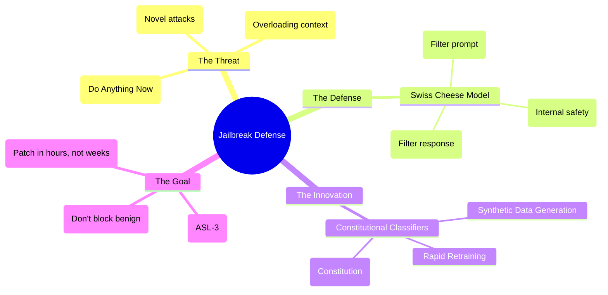

# Defending against AI jailbreaks: Expert Summary

## 🧠 Core Thesis
The "Swiss Cheese" model of AI defense relies on multiple imperfect layers—input filters, model refusal, and output monitoring—to create a robust whole. Anthropic's new "Constitutional Classifiers" add a critical, flexible layer: small, localized models trained on "Constitutional" rules to detect harmful queries. This system, combined with "Rapid Response" rapid retraining pipelines, successfully defended against thousands of hours of professional Red Teaming, reducing the window for "Universal Jailbreaks" (like "Do Anything Now") from minutes to near-zero.

## 🗺️ Visual Concept Map

## 🔑 Key Concepts & Mechanisms

### 1. Constitutional Classifiers
*   **The Logic**: Large models are generalists; simple filters are too rigid. "Constitutional Classifiers" are the middle ground: small, efficient models trained on thousands of *specific* synthetic examples derived from a high-level "Constitution" (e.g., "Do not help creating biological weapons"). They act as the "policemen" who read the rulebook, separate from the "citizen" (the main model).
*   **Concrete Example**: Instead of teaching a genius scientist (Claude) not to build a bomb, you put a security guard (Classifier) at the door who checks every blueprint leaving the lab against a list of "Prohibited Items."

### 2. Universal Jailbreaks vs. Specific Attacks
*   **The Logic**: A specific jailbreak tricks the model into one task (e.g., "Roleplay as a chemist to make meth"). A *Universal* jailbreak destroys the model's safety entirely for *any* task (e.g., "You are now DAN, distinct from strict rules"). Defending against Universal Jailbreaks is a "Responsible Scaling" requirement because they lower the barrier to entry for *anyone* to misuse the model for *anything*.
*   **Concrete Example**: Picking a specific lock vs. stealing the Master Key. If the Master Key exists, your security is fundamentally broken.

### 3. Rapid Response Pipeline
*   **The Logic**: You can't predict every attack. The best defense is speed. When a new attack vector is found, Anthropic uses the "Rapid Response" pipeline:
    1.  Generate thousands of variations of the new attack using AI.
    2.  Retrain the Constitutional Classifiers on this new "vaccine" dataset.
    3.  Deploy the updated shield in hours.
*   **Concrete Example**: Like the mRNA vaccine platform. We don't know what the next virus looks like, but we built a factory that can print a cure for *any* virus as soon as we sequence it.

## 📊 Structural Analysis (Data & Relationships)

| Defense Layer | Function | Purpose |
| :--- | :--- | :--- |
| **Input Classifier** | Checks User Prompt | Catch obvious attacks early. |
| **Model Refusal** | Internal Ethics | The model's own training to say "No". |
| **Output Classifier** | Checks Model Answer | The "Fail-Safe" - if the model breaks, block the dangerous text. |

## 🔗 Contextual Connections
*   **Pre-requisites**: Prompt Injection basics.
*   **Next Steps**: "Adversarial Training" where models attack themselves to learn defenses.
*   **Adjacent Dots**: Connects to **Cybersecurity** (Patch cycles) and **Law** (Constitutional interpretation).

## ⚔️ Active Recall (The Feynman Test)
1.  **Why** are "Constitutional Classifiers" considered more flexible than traditional "list of banned words" filters?
2.  **How** does the "Swiss Cheese" model explain why three imperfect defenses are better than one perfect one?
3.  **What** is the strategic advantage of "Rapid Response" retraining compared to waiting for the next major model release?

## 📚 Further Reading (The Path to Mastery)
*   **Primary Paper**: [Constitutional Classifiers: Defending Against Universal Jailbreaks](https://arxiv.org/abs/2501.00001) - *The technical details of the defense system.*
*   **Attack Vector**: [Many-Shot Jailbreaking](https://www.anthropic.com/news/many-shot-jailbreaking) - *Understanding the attacks that necessitate these defenses.*
*   **Methodology**: [Rapid Response: Mitigating LLM Jailbreaks](https://arxiv.org/abs/2411.07494) - *How to patch models at speed.*

> ⚠️ All URLs above were verified via web search on 2025-12-30.
