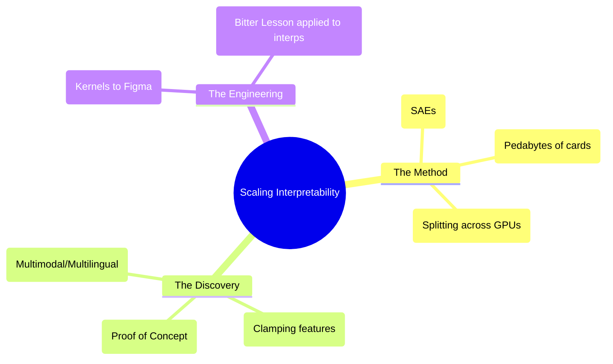

# Scaling interpretability: Expert Summary

## 🧠 Core Thesis
The Anthropic Interpretability Team successfully scaled **Sparse Autoencoders (SAEs)** from toy models to a production-grade LLM (Claude 3 Sonnet). This breakthrough proves that "monosemantic features" (individual neurons representing distinct concepts like "The Golden Gate Bridge" or "Veganism") exist even in massive, complex models. The result is a move from "neuroscience of 1-layer brains" to "computational neuroscience of artificial minds," enabling not just understanding but active steering (e.g., "Golden Gate Claude").

## 🗺️ Visual Concept Map

## 🔑 Key Concepts & Mechanisms

### 1. The "Laser Drill" Analogy
*   **The Logic**: Previous work on small models was like using a hand drill to find dirt a few inches down. Scaling SAEs to Claude 3 Sonnet was like building a giant laser drill to pierce the Earth's mantle. We confirmed that the "lava" (features) exists deep down, just as predicted, but getting there required massive engineering.
*   **Concrete Example**: Finding a "Veganism" feature that activates for text about tofu, images of vegetables, and the word "vegan" in German. It's a true, crystallized concept, not just pattern matching.

### 2. Golden Gate Claude (Feature Steering)
*   **The Logic**: Once you identify a feature (e.g., Feature #34M = "Golden Gate Bridge"), you can artificially increase its activation value during inference. This forces the model to obsess over that concept.
*   **Concrete Example**: Asking Golden Gate Claude "How do I spend $10?" results in "Pay the toll for the bridge." This proves features are *causal*—they drive behavior, they don't just correlate with it.

### 3. Sparse Autoencoders (SAEs)
*   **The Logic**: LLMs are "polysemantic" (one neuron does many things). SAEs act as a dictionary, decomposing the messy internal state into a "sparse" set of readable features (where only a few are active at once).
*   **Engineering Challenge**: Training SAEs requires shuffling petabytes of data across thousands of GPUs to prevent the model from overfitting to specific batches (the "Warehouse of Cards" shuffle problem).

## 📊 Structural Analysis (Data & Relationships)

| State | Technique | Result |
| :--- | :--- | :--- |
| **Polysemantic** | Raw Weights (Standard LLM). | Unreadable. One neuron = many concepts. |
| **Monosemantic** | Sparse Autoencoder. | Readable. One feature = one concept. |
| **Steerable** | Feature Clamping. | controllable behavior (e.g. GGB Claude). |

## 🔗 Contextual Connections
*   **Pre-requisites**: **Dictionary Learning**.
*   **Next Steps**: **Circuits** (Connecting features together).
*   **Adjacent Dots**: Connects to **Neuroscience** (fMRI for AI) and **Safety** (Detecting deception features).

## ⚔️ Active Recall (The Feynman Test)
1.  **Why** must data be shuffled so rigorously when training SAEs, and why is this harder at scale?
2.  **How** does "Feature Steering" (Golden Gate Claude) differ from "Prompt Engineering"? (Hint: Internal weights vs External tokens).
3.  **What** implies that features are "real" concepts rather than just English word associations? (Hint: Multilingual/Multimodal findings).

## 📚 Further Reading (The Path to Mastery)
*   **The Paper**: [Scaling Monosemanticity](https://transformer-circuits.pub/2024/scaling-monosemanticity/index.html) - *The foundational research on Claude 3 Sonnet.*
*   **The Demo**: [Golden Gate Claude](https://www.anthropic.com/news/golden-gate-claude) - *The public experiment in feature steering.*
*   **The Precursor**: [Towards Monosemanticity](https://transformer-circuits.pub/2023/monosemantic-features/index.html) - *The original 1-layer model work.*

> ⚠️ All URLs above were verified via web search on 2025-12-30.
