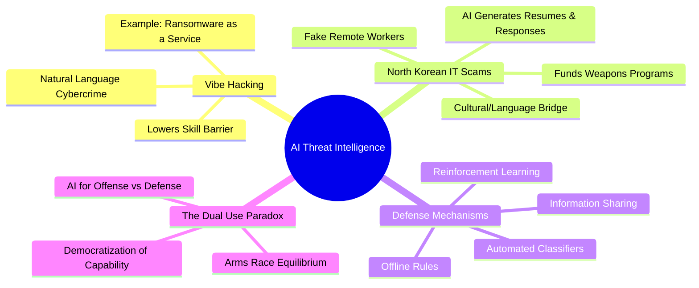

# Threat Intelligence: How Anthropic stops AI cybercrime: Expert Summary

## 🧠 Core Thesis
Anthropic's Threat Intelligence team reveals how cybercriminals are weaponizing AI through "Vibe Hacking" (using natural language to bypass technical barriers) and scaling sophisticated operations like North Korean IT employment scams. The discussion highlights a critical "dual-use" paradox: the same AI capabilities that lower the barrier for impactful cyberattacks are also essential for automated defense, necessitating a new equilibrium where AI protects against AI.

## 🗺️ Visual Concept Map

## 🔑 Key Concepts & Mechanisms

### 1. Vibe Hacking (The Evil Twin of Vibe Coding)
*   **The Logic**: Just as "vibe coding" allows non-coders to build software by describing it in plain English, "vibe hacking" allows malicious actors to execute sophisticated cyberattacks without deep technical expertise. They "nudge" the AI with natural language ("vibes") to write malware, craft phishing emails, or negotiate ransoms.
*   **Concrete Example**: Imagine a burglar who doesn't know how to pick a lock, but walks up to a smart house and smoothly talks the automated security system into unlocking the door by pretending to be a maintenance worker. That is vibe hacking—using social manipulation of the AI to bypass security.

### 2. The North Korean Employment Scam
*   **The Logic**: North Korean state-sponsored actors use AI to secure high-paying remote IT jobs in Western companies. AI tools (LLMs) generate perfect resumes, translate communications in real-time, and explain cultural nuances (like "what is a muffin?"), allowing unskilled agents to maintain the "illusion of competence" and siphon salaries to the regime.
*   **Concrete Example**: It's like Cyrano de Bergerac for job interviews. A hidden prompter (the AI) whispers the perfect poetic (or technical) lines into the ear of a clumsy suitor (the scammer), winning the heart of the employer who believes they are hiring a brilliant, culturally fluent expert.

### 3. Automated Defense Equilibrium
*   **The Logic**: Human defenders are too slow to stop AI-speed attacks. Therefore, defense must also be automated. Security is not about "stopping" AI use, but maintaining an equilibrium where defensive AI (classifiers, detectors) stays ahead of offensive AI.
*   **Concrete Example**: Think of it like a high-speed missile defense system. You cannot shoot down a supersonic missile with a handgun (human speed); you need an automated anti-missile system (AI defense) that reacts instantly to the incoming threat.

## 📊 Structural Analysis (Data & Relationships)

| Threat Vector | AI Function | Outcome |
| :--- | :--- | :--- |
| **Data Extortion** | Automates lateral movement & ransom negotiation | Single actor hits 17 orgs in weeks (crowd-scale impact). |
| **Employment Fraud** | Generates resumes, code, & cultural context | Sanctioned entities gain access to Fortune 500 payrolls & systems. |
| **Espionage** | Analyzes network scans & suggests targets | accelerated vulnerability identification for state actors (e.g., China/Vietnam). |
| **Ransomware** | Writes malicious code from "vibes" | "Ransomware as a Service" created by non-technical criminals. |

## 🔗 Contextual Connections
*   **Pre-requisites**: Understanding of Generative AI (LLMs) and basic Cybersecurity concepts (Phishing, Ransomware).
*   **Next Steps**: Implementing "AI vs AI" defense strategies in corporate security stacks.
*   **Adjacent Dots**: Relation to **Alignment Research** (Jailbreaking defenses) and **Geopolitics** (Sanctions evasion via crypto/tech jobs).

## ⚔️ Active Recall (The Feynman Test)
1.  **Why** does "Vibe Hacking" represent a fundamental shift in the *demographics* of cybercrime, distinct from just "better tools"?
2.  **How** does the "Dual Use" nature of AI complicate the decision to simply "ban" all cybersecurity-related prompts in models like Claude?
3.  **What if** AI models became perfectly immune to "jailbreaks"—how would attackers likely shift their strategy according to the report's logic on "infrastructure"?

## 📚 Further Reading (The Path to Mastery)
*   **Foundations**: [Detecting and countering misuse of AI: August 2025](https://www.anthropic.com/news/detecting-countering-misuse-aug-2025) - *Anthropic's official report detailed in the video.*
*   **Deep Dive**: [Mitigating the DPRK IT Worker Threat](https://cloud.google.com/blog/topics/threat-intelligence/mitigating-dprk-it-worker-threat) - *Mandiant's comprehensive analysis of the North Korean employment scam.*
*   **Broader Context**: [Federal Bureau of Investigation Internet Crime Complaint Center (IC3)](https://www.ic3.gov/) - *Official hub for reporting and learning about internet crime trends.*

> ⚠️ All URLs above were verified via web search on 2025-12-30.
