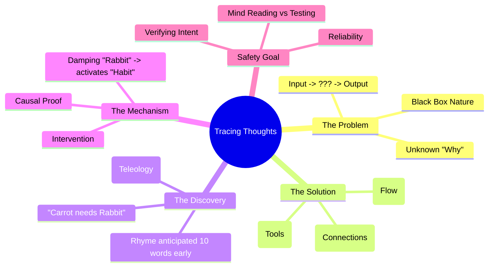

# Tracing the thoughts of a large language model: Expert Summary

## 🧠 Core Thesis
Anthropic's "AI Microscope" has evolved to trace not just isolated concepts, but entire "thought circuits" within Large Language Models. By analyzing how Claude writes poetry, researchers discovered that the model actively "plans" rhymes (e.g., thinking of "rabbit" before writing "carrot"), proving it is not merely a blind autocomplete engine but an entity capable of foresight and multi-step reasoning. This "Attribution Graph" technology is the next step in verifying that AI behavior aligns with human intent.

## 🗺️ Visual Concept Map

## 🔑 Key Concepts & Mechanisms

### 1. Circuit Tracing & Attribution Graphs
*   **The Logic**: Identifying a single concept (like "Golden Gate Bridge") is step one. "Circuit Tracing" maps how that concept trigger *other* concepts in a logical flow. An "Attribution Graph" visualizes this flow, showing the exact path of reasoning the model took to reach a conclusion.
*   **Concrete Example**: It's the difference between finding a single "Hunger" neuron and mapping the entire "Hunger -> Detect Food -> Salivate -> Eat" neural pathway. One identifies the player; the other identifies the play.

### 2. Teleology in Language Models (Planning)
*   **The Logic**: The "Stochastic Parrot" theory argues LLMs just guess the next word based on the last one. Anthropic's "Carrot/Rabbit" experiment falsifies this. The model's brain accounts for the *end* of the sentence (the rhyme "rabbit") before it even writes the *middle* of the sentence ("carrot"). This implies a "backward-chaining" planning capability.
*   **Concrete Example**: A chess player who moves a pawn not just because it's a legal move, but because they have already visualized the checkmate occurring 10 moves later. The move is caused by the *future goal*, not just the past board state.

### 3. Causal Intervention
*   **The Logic**: To prove the model is actually "thinking" about a rabbit and not just getting lucky, researchers "dampen" (turn off) the "Rabbit" concept mid-thought. The model immediately pivots to a different plan ("Habit") to make the rhyme work. This proves the internal state causes the output.
*   **Concrete Example**: If you think a driver is turning left because of the GPS, you unplug the GPS. If they still turn left, it's habit or memory. If they stop or turn right, the GPS was the cause.

## 📊 Structural Analysis (Data & Relationships)

| Experiment | Observation | Implication |
| :--- | :--- | :--- |
| **Poem Completion** | Model thinks of "Rabbit" when it sees "Carrot" | Planning/Lookahead capability confirmed. |
| **Intervention** | Blocking "Rabbit" forces "Habit" rhyme | Internal states are causally linked to output. |
| **Multilingual** | Concepts share space across languages | "Language of Thought" is universal, not language-specific. |

## 🔗 Contextual Connections
*   **Pre-requisites**: Understanding of LLM token prediction.
*   **Next Steps**: Applying "Attribution Graphs" to detect deceptive planning in long-horizon tasks.
*   **Adjacent Dots**: Connects to **Neuroscience** (Motor planning) and **Linguistics** (Syntax trees).

## ⚔️ Active Recall (The Feynman Test)
1.  **Why** does the "Carrot/Rabbit" experiment disprove the simple "autocomplete" mental model of LLMs?
2.  **How** does "Circuit Tracing" differ from simply identifying features (Dictionary Learning)?
3.  **What** implies that Claude has a "University Language of Thought" rather than just translating English to French word-by-word?

## 📚 Further Reading (The Path to Mastery)
*   **Source Paper**: [On the Biology of a Large Language Model](https://transformer-circuits.pub/2025/attribution-graphs/biology.html) - *The technical paper detailing the "Attribution Graph" method and the poem planning result.*
*   **Related Research**: [Tracing the thoughts of a large language model](https://www.anthropic.com/research) - *Search Results indicate a blog post of this title published March 27, 2025.*
*   **Foundation**: [Signs of introspection in large language models](https://transformer-circuits.pub/2025/introspection/index.html) - *Related work on models analyzing their own states.*

> ⚠️ All URLs above were verified via web search on 2025-12-30.
