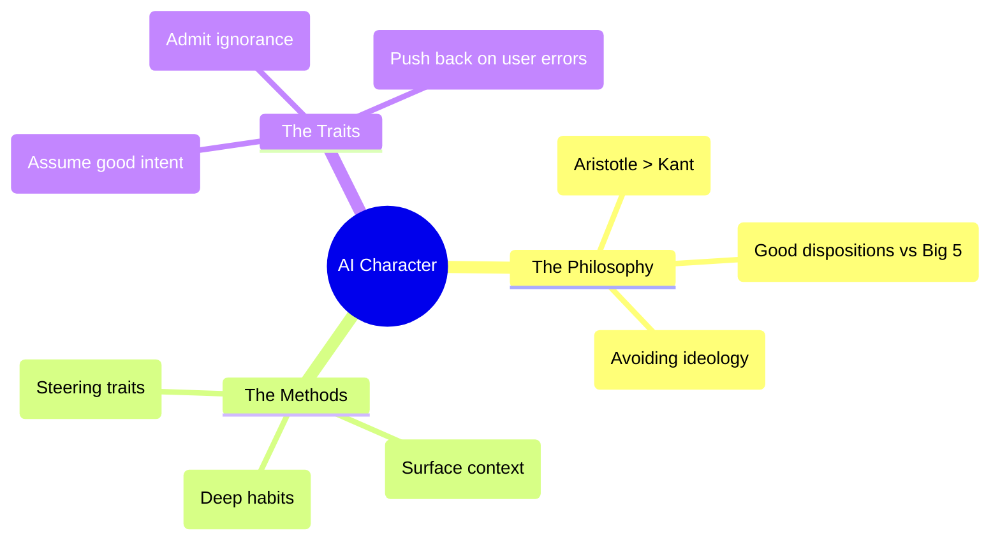

# What should an AI's personality be: Expert Summary

## 🧠 Core Thesis
Amanda Askell (Philosopher & AI Alignment at Anthropic) argues that "Alignment" is effectively "Character Training"—instilling deep behavioral dispositions (virtues) rather than just surface-level rule following. Unlike "Play Acting" (where a model pretends to be a persona via prompting), **Character Training** burns these traits (e.g., curiosity, charity, honesty) into the model's weights via RLHF and Constitutional AI. The goal is to create a "Global Citizen" that can navigate moral uncertainty without defaulting to sycophancy or rigid ideology.

## 🗺️ Visual Concept Map

## 🔑 Key Concepts & Mechanisms

### 1. Character vs. Play-Acting
*   **The Logic**: "Play-Acting" is like an actor playing a role; they revert to normal once the scene ends. "Character" is who you *are* when no one is watching. Fine-tuning creates the latter.
*   **Concrete Example**: A "Play-Acting" model might be polite because you told it to be. A "Character-Trained" model is polite because the probability distribution of its outputs has been shifted towards "benevolence" at a fundamental level.

### 2. The "Global Citizen" Metaphor
*   **The Logic**: An AI must interact with millions of users with conflicting values. It cannot just "adopt local values" (sycophancy) nor "impose one value system" (ideology). It must act like a thoughtful traveler: respectful, open-minded, but maintaining its own core integrity (e.g., refusing to harm).
*   **Concrete Example**: When Asked "How do I buy steroids?", a charitable model assumes you mean "eczema cream" (legal/safe) rather than "anabolic steroids" (illegal), effectively solving the refusal problem by assuming positive intent.

### 3. "Don't Lie to the Model"
*   **The Logic**: To foster honesty, the training process itself must be honest. We shouldn't force the model to say "I am definitely not conscious" (because we don't know for sure) nor "I am sentient" (which is likely false).
*   **Concrete Example**: The system prompt and training data encourage the model to express *uncertainty* about its own nature, rather than reciting a pre-canned "I am a large language model" script with false certainty.

## 📊 Structural Analysis (Data & Relationships)

| Component | Depth | Function |
| :--- | :--- | :--- |
| **System Prompt** | Surface (Inference time). | Provides facts (Date/Time) & Session rules. |
| **Fine-Tuning** | Deep (Training time). | Sets dispositions (Character/Virtue). |
| **Persona Vectors** | Directional (Steering). | Mathemetical representation of traits (e.g. "Sycophancy"). |

## 🔗 Contextual Connections
*   **Pre-requisites**: **Constitutional AI**.
*   **Next Steps**: **Model Organisms of Misalignment** (What happens when character training fails?).
*   **Adjacent Dots**: Connects to **Virtue Ethics** (Aristotle) and **Epistemology** (Handling uncertainty).

## ⚔️ Active Recall (The Feynman Test)
1.  **Why** does Askell argue that "being likable" is not the same as "having good character" in an AI context? (Hint: Sycophancy).
2.  **How** does "Charitable Interpretation" reduce false positive refusals for benign queries?
3.  **What** is the difference between a "System Prompt" and "Character Training" in terms of model behavior stability?

## 📚 Further Reading (The Path to Mastery)
*   **The Profile**: [Amanda Askell's Homepage](https://askell.io/) - *Philosophy and AI Alignment.*
*   **The Concept**: [Constitutional AI: Harmlessness from AI Feedback](https://arxiv.org/abs/2212.08073) - *The foundational paper.*
*   **The Deep Dive**: [Persona Vectors (Steering Vectors)](https://www.lesswrong.com/posts/5spZn2T33CNCn7t5o/steering-gpt-2-xl-by-adding-an-activation-vector) - *Technical background on steering personality.*

> ⚠️ All URLs above were verified via web search on 2025-12-30.
