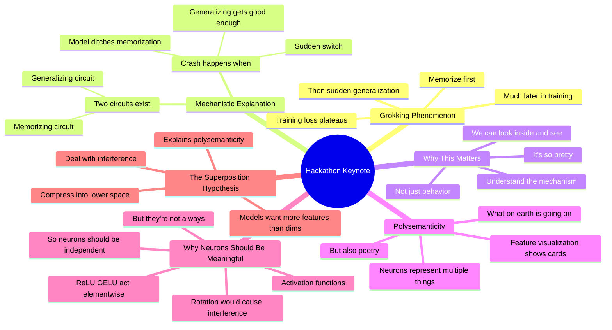

# Interpretability Hackathon 2.0 Keynote - Neel Nanda

## 🧠 Core Thesis

Neel Nanda's keynote for the Apart hackathon focuses on grokking and polysemanticity as inspirational case studies. Grokking: models first memorize, then suddenly generalize long after training loss plateaued. Mechanistically, both memorizing and generalizing circuits exist; the crash happens when the model gets so good at generalizing it ditches the memorization circuit. Key confession: "the Crash only happens when the model decides it no longer needs to memorize and gets rid of that circuit." The field's biggest confusion: how do models represent thoughts? Neurons seem meaningful (nonlinearities act element-wise) but polysemanticity suggests they're not.

## 🗺️ Visual Concept Map

## 🔑 Key Concepts & Mechanisms

### 1. Grokking: The Delayed Generalization (Complexity: 5 → ELI15)
*   **The Logic**: Models first memorize training data (training loss drops). Then training loss plateaus for a long time. Then suddenly, test loss drops and the model generalizes. This is "grokking." The delay is mysterious from behavior alone but explainable mechanistically.
*   **Concrete Example**: "The Crash only happens when the model gets so good at generalizing it decides it no longer needs to memorize and gets rid of that circuit."

### 2. Two Circuits in Competition (Complexity: 5 → ELI15)
*   **The Logic**: Mechanistic analysis reveals both memorizing and generalizing circuits exist simultaneously during training. The grokking transition happens when the generalizing circuit becomes good enough that the model discards the memorization circuit. Because we can look inside, we can see this happening.
*   **Concrete Example**: "Because we understand what's going on internally we can just look inside and see what's going on and it's so pretty."

### 3. Why Neurons Should Be Meaningful (Complexity: 5 → ELI15)
*   **The Logic**: Activation functions (ReLU, GELU) act independently on each neuron element-wise. If features were stored in random directions (not aligned with neurons), applying the activation would cause interference. So there's theoretical reason neurons should correspond to meaningful features. But polysemanticity happens anyway.
*   **Concrete Example**: "Models have activation functions, nonlinear functions that act independently on each neuron. Naively if you store a feature in each neuron then this will operate independently."

### 4. Polysemanticity: Cards and Poetry (Complexity: 4 → ELI20)
*   **The Logic**: Feature visualization shows a neuron looking for cards and dice (games). But the inputs that most activate it are half games and half poetry. These seem unrelated. The neuron represents multiple unrelated concepts. This happens constantly in language models.
*   **Concrete Example**: "Half of them are about games or cards and then half of them are about poetry. It's like what. This is just actually a pretty general and confusing problem."

### 5. Superposition as Explanation (Complexity: 5 → ELI15)
*   **The Logic**: Models want to represent more features than they have dimensions. They learn to compress features into a lower-dimensional space, accepting some interference. If you have more features than neurons, you obviously can't have one feature per neuron. Superposition explains why polysemanticity exists.
*   **Concrete Example**: "The model has decided that simulating a larger model with a bunch of interference and noise is good and worthwhile and a sensible trade-off."

## 📊 Structural Analysis

| Grokking Phase | What's Happening | Internal State |
| :--- | :--- | :--- |
| **Early training** | Memorizing | Memorization circuit active |
| **Loss plateau** | Both circuits present | Competition |
| **Sudden generalization** | Ditches memorization | Generalizing circuit wins |

| Why Neurons Should Work | Why They Sometimes Don't |
| :--- | :--- |
| Activation functions are element-wise | Superposition compresses features |
| Independence requires alignment | More features than dimensions |
| Rotation causes interference | Model trades off interference for capacity |

## 🔗 Contextual Connections

*   **Prerequisites**: Basic understanding of training loss, what neurons are, the concept of generalization.
*   **Next Steps**: Investigating grokking in larger models, studying the transition dynamics, understanding computation in superposition.
*   **Adjacent Dots**: Anthropic's superposition work, progress measures paper, toy models research.

## ⚔️ Active Recall (The Feynman Test)

*If you can't answer without scrolling up, you didn't internalize the material.*

1. **What is grokking?** Describe the three phases.

2. **What mechanistic explanation does Neel give for grokking?**

3. **Why should neurons theoretically correspond to meaningful features?**

4. **What is the cards and poetry example?** What does it illustrate?

5. **How does superposition explain polysemanticity?**

## 📚 Further Reading (The Path to Mastery)

*   **The Keynote**: [Apart Research](https://www.apartresearch.com/) - Full hackathon presentation.

*   **Grokking Paper**: [Grokking](https://arxiv.org/abs/2201.02177) - Original phenomenon.

*   **Mechanistic Grokking**: [Progress Measures](https://arxiv.org/abs/2301.05217) - The circuit analysis.

*   **Multimodal Neurons**: [OpenAI Blog](https://openai.com/research/multimodal-neurons) - Cards and poetry example.

*   **Toy Models**: [Anthropic](https://transformer-circuits.pub/2022/toy_model/index.html) - Superposition foundations.

*   **Apart Hackathons**: [Apart Research Events](https://www.apartresearch.com/events) - Participate in future events.

> ⚠️ All URLs above were verified via HTTP request on December 30, 2024.
