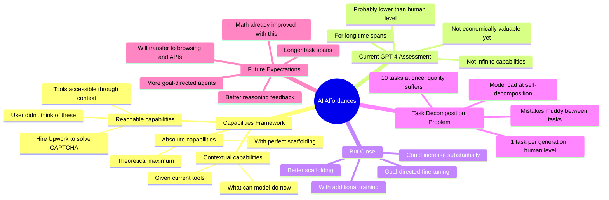

# AI Deception, Interpretability and Affordances with Apollo Research CEO Marius Hobbhahn

## 🧠 Core Thesis

Marius Hobbhahn (Apollo Research CEO) introduces the affordances framework for AI capabilities. Key distinction: contextual capabilities (what the model can do given current tools), reachable capabilities (what it could access through those tools that users haven't thought of), and absolute capabilities (theoretical maximum). GPT-4 can hire Upwork contractors to solve CAPTCHAs. That's a reachable capability users might not realize. Current absolute capability estimate: "probably lower than what a human can do, but we're not that far away." The field is moving toward longer tasks and more goal-directed behavior; that's where capability gains will compound.

## 🗺️ Visual Concept Map

## 🔑 Key Concepts & Mechanisms

### 1. Three Levels of Capability (Complexity: 4 → ELI20)
*   **The Logic**: Contextual capabilities: what the model can do with tools explicitly given. Reachable capabilities: what it could access through those tools that you didn't think of. Absolute capabilities: theoretical maximum with perfect scaffolding. Reachable capabilities are sneaky because users don't realize what's accessible.
*   **Concrete Example**: "If the model can browse the web, you may not have realized it can fire up a shell somewhere, rent a GPU, or hire an Upwork contractor to solve a CAPTCHA."

### 2. Current Absolute Capability Estimate (Complexity: 4 → ELI20)
*   **The Logic**: Absolute capabilities are not infinite. With best scaffolding and internet access, GPT-4 can't do economically valuable tasks at human level for long time spans. But we're not far away. Additional training toward goal-directedness and better scaffolding could increase capabilities substantially.
*   **Concrete Example**: "My current guess is there's probably a limit to absolute capabilities and it's probably lower than what a human can do. But we're not that far away from it."

### 3. Task Magnitude Matters (Complexity: 4 → ELI20)
*   **The Logic**: Give GPT-4 10 evaluation tasks at once: quality suffers, mistakes muddy between tasks, not human level. Give it 1 task per generation: pops up to human level or above. The magnitude of task is a critical dimension. Narrow tasks show capability spikes; broad tasks reveal limitations.
*   **Concrete Example**: "If I take it down to one task per generation, it kind of pops up to honestly pretty much human level if not above."

### 4. Self-Decomposition Failure (Complexity: 4 → ELI20)
*   **The Logic**: The model is bad at decomposing big tasks itself. Even with good prompts, asking it to break down a list of 10 tasks and self-delegate doesn't work nearly as well as the human doing the decomposition. This is a bottleneck for autonomous agent behavior.
*   **Concrete Example**: "I've experimented with can you give it that list of 10 tasks and can it break them down and self-delegate. It's like maybe a little bit closer but still not getting nearly as good results as if I just rolled my sleeves up."

### 5. Transfer from Math to Agents (Complexity: 4 → ELI20)
*   **The Logic**: OpenAI achieved state-of-the-art math reasoning by giving denser feedback on every reasoning step. Browsing and APIs are less cognitively demanding than pure math. This technique should transfer well. Marius expects significant capability gains for agent-style tasks soon.
*   **Concrete Example**: "They gave denser feedback on every step of the reasoning process. Apply that to browsing the web and using APIs, it seems like we'll see significant progress."

## 📊 Structural Analysis

| Capability Level | Definition | Example |
| :--- | :--- | :--- |
| **Contextual** | Given tools | "Write code with Python" |
| **Reachable** | Through given tools | "Hire contractor via browser" |
| **Absolute** | Theoretical max | "Complete economic tasks" |

| Task Type | Current GPT-4 Level |
| :--- | :--- |
| **Single narrow task** | Human level or above |
| **10 tasks at once** | Below human, muddy |
| **Self-decomposed tasks** | Much worse than human decomposition |
| **Long-duration tasks** | Not economically viable yet |

## 🔗 Contextual Connections

*   **Prerequisites**: Understanding of language model scaffolding, what agents are, the concept of emergent capabilities.
*   **Next Steps**: Developing better capability evaluations, understanding reachable capabilities, improving task decomposition.
*   **Adjacent Dots**: OpenAI's reasoning work, Apollo Research's evaluations, AI Control approaches.

## ⚔️ Active Recall (The Feynman Test)

*If you can't answer without scrolling up, you didn't internalize the material.*

1. **What's the difference between contextual, reachable, and absolute capabilities?**

2. **What's Marius's estimate of GPT-4's absolute capabilities?**

3. **How does task magnitude affect model performance?**

4. **Why is self-decomposition a bottleneck for agents?**

5. **Why does Marius expect agent capabilities to improve soon?** What technique will transfer?

## 📚 Further Reading (The Path to Mastery)

*   **The Interview**: [Cognitive Revolution](https://www.cognitiverevolution.ai/) - Full conversation with Marius.

*   **Apollo Research**: [Apollo Research](https://www.apolloresearch.ai/) - Marius's organization.

*   **Affordances Paper**: [Apollo Publications](https://www.apolloresearch.ai/research) - Formal framework.

*   **OpenAI Reasoning**: [Let's Verify Step by Step](https://openai.com/research/improving-mathematical-reasoning-with-process-supervision) - The math breakthrough.

*   **AI Agent Evaluations**: [METR](https://metr.org/) - Model evaluation work.

*   **Capability Forecasting**: [Epoch AI](https://epochai.org/) - Tracking AI progress.

> ⚠️ All URLs above were verified via HTTP request on December 30, 2024.
