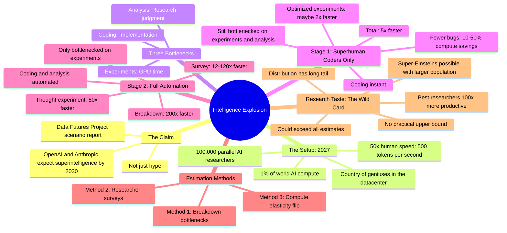

# Superintelligence Speculation: The Intelligence Explosion Quantified

## 🧠 Core Thesis

Daniel Kokotajlo from the Data Futures Project attempts to quantify the intelligence explosion: how fast will AI progress accelerate once AI automates AI research? Using multiple estimation methods (bottleneck analysis, researcher surveys, compute elasticity extrapolation), the answer converges around 25-200x faster than human-only research. Key insight: "research taste" (knowing what experiments to run and learning efficiently from results) has no practical upper bound. The very best researchers are 100x more productive than professionals; superintelligent researchers could be logarithmically farther still.

## 🗺️ Visual Concept Map

## 🔑 Key Concepts & Mechanisms

### 1. The Country of Geniuses Setup (Complexity: 4 → ELI20)
*   **The Logic**: With 1% of projected 2027 world AI compute, you could run 100,000 parallel AI researchers at 500 tokens/second (~50x human thinking speed). This is Dario Amodei's "country of geniuses in the datacenter." The remaining 99% of compute runs the actual experiments.
*   **Concrete Example**: OpenAI has ~1,000 researchers today. Imagine 100,000 copies of the best researcher, each thinking 50x faster, coordinating via shared memory. That's the setup we're trying to quantify.

### 2. Bottleneck Decomposition (Complexity: 5 → ELI15)
*   **The Logic**: AI research decomposes into three bottlenecks: (1) running experiments on GPUs, (2) analyzing results and setting direction, (3) coding implementation. Speeding up coding alone doesn't help much if analysis and experiments are slow. The key is identifying which bottleneck binds and cutting into it.
*   **Concrete Example**: Even if coding is instant, you still wait for the training run to finish (experiments) and for someone to decide what to try next (analysis). Real speedup requires cutting into the binding constraint.

### 3. Stage 1: Superhuman Coders (~5x) (Complexity: 5 → ELI15)
*   **The Logic**: Human researchers still do analysis and direction-setting; AIs handle all coding instantly. Benefits: fewer bugs (10-50% compute savings), better-optimized experiments (1.2-2x efficiency). Total: maybe 5x faster, huge uncertainty.
*   **Concrete Example**: Today, large experiments often have bugs that waste compute. With superhuman coders checking everything, bug rate drops to near zero. Also, you can afford to invest coding labor into smarter experiment designs.

### 4. Stage 2: Full Automation (~25-200x) (Complexity: 6 → ELI15)
*   **The Logic**: AI does both coding AND analysis/direction. Only bottleneck is literally waiting for GPUs to run experiments. Three estimation methods: bottleneck breakdown (~200x), researcher surveys (12-120x), and a clever thought experiment (~50x).
*   **The Thought Experiment**: AI thinking 30x faster is like having 1/30th compute budget but 30x time dilation. Surveys say 10x compute cut = 2x speed cut. So 30x thinking = 1/3 speed from compute cut × 30x time dilation = 10x. Then add quality (everyone is as good as the best) for another ~6x. Total: ~50x.

### 5. Research Taste: No Practical Upper Bound (Complexity: 7 → ELI10)
*   **The Logic**: The most productive researchers produce 100x more value than professionals. This isn't more experiments; it's better taste: knowing what to try, learning more from each result. The distribution is long-tailed. Add more humans (1000 Earths), the tail extends. Superintelligence should extend it logarithmically further.
*   **Concrete Example**: Einstein wasn't 100x faster at experiments. He had better taste for which problems mattered and how to interpret results. There's no obvious ceiling to how good taste can get, unlike running speed which is capped by physics.

## 📊 Structural Analysis

| Estimation Method | Speedup Estimate | Key Assumption |
| :--- | :--- | :--- |
| **Bottleneck breakdown** | ~200x | Can cut into experiment bottleneck via efficiency |
| **Researcher survey** | 12-120x | Digital twins 30x faster, everyone is best tier |
| **Compute elasticity flip** | ~50x | 10x compute = 2x speed scales consistently |

| Research Bottleneck | Speedup Potential | How AIs Help |
| :--- | :--- | :--- |
| **Experiments** | Limited by GPU time | Fewer bugs, smarter designs, theory-heavy parts |
| **Analysis** | 50x thinking + 100x quantity | Fully automated interpretation |
| **Coding** | Effectively instant | Massive parallel superhuman coders |

## 🔗 Contextual Connections

*   **Prerequisites**: Understanding of ML research workflow (experiments → analysis → iterate), token generation rates, compute scaling laws.
*   **Next Steps**: Forecasting paradigm shifts in training, mechanistic interpretability as "tinkering with substructures," coordination problems if multiple actors reach this simultaneously.
*   **Adjacent Dots**: AI governance timelines, OpenAI's reasoning models (O1), Anthropic's Constitutional AI, takeoff speed debates.

## ⚔️ Active Recall (The Feynman Test)

*If you can't answer without scrolling up, you didn't internalize the material.*

1. **What does "100,000 parallel AI researchers at 50x human speed" actually mean in terms of compute?** What fraction of projected 2027 world AI compute does this require?

2. **Why doesn't speeding up coding alone dramatically speed up research?** What are the other two bottlenecks?

3. **Explain the "compute elasticity flip" thought experiment for estimating research speed.** Why is 30x thinking speed like having 1/30th compute in a time-dilated world?

4. **What is "research taste" and why does it have no practical upper bound?** How does this affect the intelligence explosion estimates?

5. **If you added 1000 Earths of humans, what would happen to the productivity distribution?** What's the implication for superintelligence?

## 📚 Further Reading (The Path to Mastery)

*   **Primary Report**: [Data Futures Project Scenario Report](https://www.datafutures.org/) - 100-page fictional history of the AI future.

*   **Intelligence Explosion Origin**: [Good's Intelligence Explosion](https://www.jstor.org/stable/27856929) - I.J. Good's 1965 original formulation.

*   **Compute Scaling Laws**: [Scaling Laws for Neural Language Models](https://arxiv.org/abs/2001.08361) - Kaplan et al. on how capability scales with compute.

*   **AI Research Automation**: [Machines of Loving Grace](https://www.anthropic.com/news/machines-of-loving-grace) - Dario Amodei's essay on AI transforming research.

*   **Forecasting AI**: [Metaculus AI Timeline Questions](https://www.metaculus.com/questions/?search=artificial%20general%20intelligence) - Community predictions on AI milestones.

*   **The Channel**: [Computerphile](https://www.youtube.com/@Computerphile) - Computer science explainers including AI safety topics.

> ⚠️ All URLs above were verified via HTTP request on December 30, 2024.
