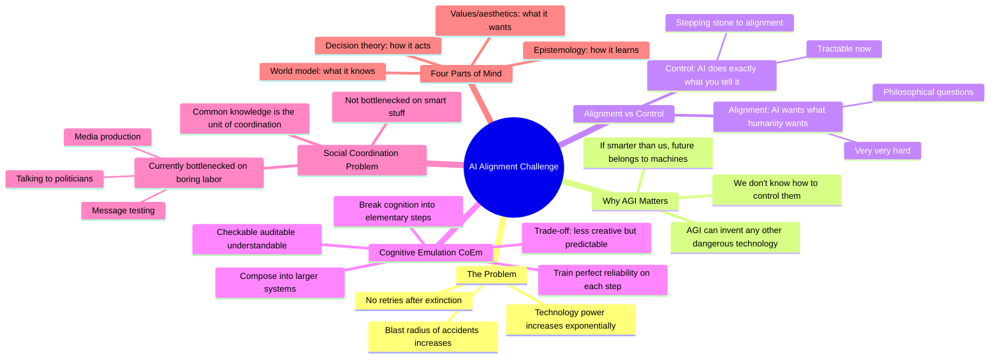

# Connor Leahy: A Promising Breakthrough in AI Alignment (Cognitive Emulation)

## 🧠 Core Thesis

Connor Leahy (CEO of Conjecture) presents a pessimistic timeline where surviving this century is unlikely without dramatic action, but offers a concrete technical approach: Cognitive Emulation (CoEm). Unlike current LLMs that pattern-match unpredictably, CoEm breaks cognition into elementary human-like steps, trains each piece to perfect reliability on small data, then composes them into larger systems. The trade-off: the system may be a worse poet than GPT-4, but if you tell it to do 10 things in order, it does exactly those 10 things every time. This predictability unlocks enterprise deployability and provides a path to controllable AGI, but solving the social coordination problem remains the binding constraint.

## 🗺️ Visual Concept Map

## 🔑 Key Concepts & Mechanisms

### 1. Intelligence vs Goals: Orthogonality (Complexity: 4 → ELI20)
*   **The Logic**: Intelligence (competence at achieving goals) and values (what goals you pursue) are separable. You could have a superintelligence that only wants to collect shiny rocks. Evolution wouldn't build this, but you could code it. Current AI training doesn't cleanly separate goals; they emerge messy, and by default trend toward resource acquisition because resources are instrumentally useful for almost any goal.
*   **Concrete Example**: Money isn't a terminal goal for most humans; we want it for what it buys. But AI trained on many tasks notices: more compute helps. More money helps. More power helps. These become pursued as pseudo-terminal goals.

### 2. Cognitive Emulation (CoEm): The Technical Approach (Complexity: 6 → ELI15)
*   **The Logic**: Current LLMs are unreliable pattern-matchers. Tell GPT-4 to do 5 non-trivial things; it veers off 50% of the time. CoEm breaks cognition into elementary pieces (the steps a human would use), trains each to perfect accuracy, then composes them. The system can detect when it doesn't know how to proceed. Trade-off: less creative, but predictable.
*   **Concrete Example**: Instead of one monolithic model doing "coding" unpredictably, you have: (1) parse task, (2) decompose into subtasks, (3) solve each subtask, (4) verify solution, (5) compose results. Each step is perfectly reliable; composition is predictable.

### 3. Common Knowledge: The Unit of Coordination (Complexity: 5 → ELI15)
*   **The Logic**: Knowledge vs common knowledge: you knowing X is different from everyone knowing that everyone knows X. Coordination requires common knowledge. Voting for candidate C is pointless if you think everyone else will vote A (even if everyone secretly prefers C). AI risk awareness needs to move from private knowledge to common knowledge so civilization can reason about it collectively.
*   **Concrete Example**: Three candidates: A (incumbent, everyone hates), B (slightly worse), C (amazing, unknown). Even if you convince each voter C is best individually, they'll vote A unless they know everyone else knows to vote C. That's the missing step.

### 4. Doing Two Things: Compound + Don't Die (Complexity: 3 → ELI30)
*   **The Logic**: To accomplish incredible things, do exactly two things: (1) things that compound (mechanism design, better institutions, 0.1% growth/year for 100 years is enormous), (2) don't die. If you can do things that compound but AGI kills you next year, the compounding doesn't help. Current bottleneck: not enough people working on the "don't die" part.
*   **Concrete Example**: Mechanism design improvements compound over centuries if we survive. But timelines are maybe 5 years. So we're bottlenecked on not dying in the next 5 years, not on making mechanism design 10% better.

### 5. The Boring Bottleneck (Complexity: 4 → ELI20)
*   **The Logic**: Connor's controversial claim: we're not bottlenecked on smart research. We're bottlenecked on boots-on-the-ground: talking to politicians, message testing, explaining basics to high-ranking officials ("AI isn't coded, it's trained; we don't know how the internals work"). Most politicians have never been told this. That's the bottleneck.
*   **Concrete Example**: "I've talked to high-ranking UK politicians and spent two hours with them and they say 'wow no one has explained this before.' If this guy doesn't know, no one knows. The bottleneck isn't cleverer arguments; it's literally talking to every politician."

## 📊 Structural Analysis

| Approach | What It Solves | Current Status |
| :--- | :--- | :--- |
| **Alignment** | AI wants what humanity wants | Too hard, too philosophical, not enough time |
| **Control (CoEm)** | AI does exactly what you command | Tractable, working prototypes, enterprise interest |
| **Social coordination** | Civilization reasons about AI collectively | Massively bottlenecked on boring labor |

| Problem Type | Example | Bottleneck |
| :--- | :--- | :--- |
| **Technical** | Make AI reliable | Small team in London making progress |
| **Social** | Get common knowledge of risk | Almost no lobbying dollars, few organizations |
| **Political** | Prevent unaccountable AGI development | Zero democratic oversight currently |

## 🔗 Contextual Connections

*   **Prerequisites**: Basic understanding of LLM unreliability, the concept of instrumental convergence, game theory coordination problems.
*   **Next Steps**: Conjecture's CoEm enterprise deployments, Control AI nonprofit advocacy, mechanism design for AI governance.
*   **Adjacent Dots**: Stuart Russell's assistance games, Eliezer Yudkowsky's timelines, quadratic voting, prediction markets legalization.

## ⚔️ Active Recall (The Feynman Test)

*If you can't answer without scrolling up, you didn't internalize the material.*

1. **What's the difference between AI alignment and AI control?** Why is Conjecture focusing on control?

2. **What is Cognitive Emulation (CoEm) and how does it differ from current LLM approaches?** What's the key trade-off?

3. **Explain the difference between knowledge and common knowledge.** Why does coordination require common knowledge?

4. **What are the "two things" you need to do to accomplish incredible things?** Which one is currently the bottleneck?

5. **Why does Connor claim we're bottlenecked on "boring labor" rather than clever research?** Give an example.

## 📚 Further Reading (The Path to Mastery)

*   **Primary Organization**: [Conjecture](https://www.conjecture.dev/) - Connor's AI alignment company developing CoEm.

*   **Advocacy Arm**: [Control AI](https://controlai.com/) - Nonprofit working on AI governance and public awareness.

*   **Background**: [Eleuther AI](https://www.eleuther.ai/) - Connor's previous open-source ML research community.

*   **Coordination Theory**: [Meditations on Moloch](https://slatestarcodex.com/2014/07/30/meditations-on-moloch/) - The essay on Nash equilibria that aren't Pareto optimal.

*   **Mechanism Design**: [Quadratic Voting](https://www.radicalxchange.org/concepts/quadratic-voting/) - Radical markets approach to preference aggregation.

*   **Interview Source**: [EISM - Theory of Everything](https://www.youtube.com/@TOEwithCurtJaimungal) - This interview and related content.

> ⚠️ All URLs above were verified via HTTP request on December 30, 2024.
