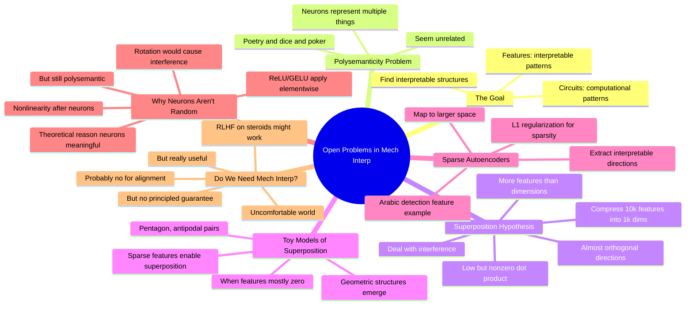

# Open Problems in Mechanistic Interpretability: A Whirlwind Tour

## 🧠 Core Thesis

Neel Nanda (Google DeepMind) presents mechanistic interpretability as finding interpretable structures (features and circuits) inside neural networks. The superposition hypothesis explains polysemanticity: models want to represent more features than they have dimensions, so they compress features almost-orthogonally and deal with interference. Sparse autoencoders (SAEs) can extract these compressed features, as shown by Anthropic finding interpretable directions like "Arabic text" from combinations of neurons. Key honesty moment: do we need mech interp for alignment? "Probably no, but it sure seems really useful." We might succeed via "RLHF on steroids" without principled guarantees, but that world seems uncomfortable.

## 🗺️ Visual Concept Map

## 🔑 Key Concepts & Mechanisms

### 1. The Superposition Hypothesis (Complexity: 5 → ELI15)
*   **The Logic**: Models want to represent more features than they have dimensions. Instead of 1000 features in 1000 dimensions (orthogonal), they compress 10,000 features into 1000 dimensions (almost orthogonal, low but nonzero dot product). The model deals with interference between features. This explains polysemanticity.
*   **Concrete Example**: "The model tries to compress in 10,000 features that are almost orthogonal to each other, that have low but not zero dot product, and the model just deals with the interference."

### 2. Sparse Features Enable Superposition (Complexity: 5 → ELI15)
*   **The Logic**: The toy models paper found that when features are sparse (zero most of the time), models are more willing to use superposition. Interference is easier to handle when one feature is off and the other is on. As sparsity increases, beautiful geometric structures emerge: pentagons, antipodal pairs.
*   **Concrete Example**: "As they increased sparsity, the model went from two features in two dimensions with orthogonal directions to beautiful geometric structures like two antipodal pairs or five features as a pentagon."

### 3. Why Neurons Aren't Totally Random (Complexity: 5 → ELI15)
*   **The Logic**: You might think neurons are just arbitrary basis vectors that could be freely rotated. But neurons immediately follow nonlinearities (ReLU, GELU) that apply element-wise. Rotation would cause substantial interference between entries. So there's theoretical reason neurons should be meaningful. But polysemanticity still happens.
*   **Concrete Example**: "If you apply an arbitrary rotation, there's now substantial interference between different entries, so different neurons can't vary independently."

### 4. Sparse Autoencoders for Feature Extraction (Complexity: 5 → ELI15)
*   **The Logic**: SAEs map activations into a larger space (expecting more features than dimensions), apply L1 regularization to make entries sparse, then try to reconstruct. The hope: each entry in the larger space is interpretable. Anthropic found features like "Arabic text" from combinations of neurons.
*   **Concrete Example**: "A linear combination of most of the MLP neurons in a one-layer language model seems to detect Arabic. When the feature fires a lot, it's super clear it's firing on Arabic."

### 5. Do We Need Mechanistic Interpretability? (Complexity: 4 → ELI20)
*   **The Logic**: Probably not strictly necessary for alignment; RLHF on steroids might work. But that world is uncomfortable: we might succeed but have no principled guarantee, could be deceptively aligned but get lucky. With interpretability, we'd be more confident we have something that's actually aligned.
*   **Concrete Example**: "We're not going to have some deeply principled guarantee that the thing is aligned. It could be deceptively aligned but turns out we get lucky. I'm not comfortable with that world."

## 📊 Structural Analysis

| Approach | What It Does | Limitation |
| :--- | :--- | :--- |
| **Neuron analysis** | Look at individual neurons | Polysemantic |
| **Sparse autoencoders** | Extract compressed features | Still scaling |
| **Toy models** | Understand superposition | Simplified setting |
| **Concept-based** | Higher-level categories | Less mechanistic |

| Question | Answer |
| :--- | :--- |
| **Need mech interp for alignment?** | Probably no |
| **Is it useful?** | Very yes |
| **Could succeed without it?** | Possible but uncomfortable |
| **Would we know system is aligned?** | Much more confident with interp |

## 🔗 Contextual Connections

*   **Prerequisites**: Basic neural network architecture, what autoencoders do, concept of sparse representations.
*   **Next Steps**: Training SAEs on larger models, understanding computation superposition (not just representation), building better conceptual frameworks.
*   **Adjacent Dots**: Anthropic's Towards Monosemanticity paper, toy models of superposition, circuit-level analysis.

## ⚔️ Active Recall (The Feynman Test)

*If you can't answer without scrolling up, you didn't internalize the material.*

1. **What is the superposition hypothesis?** Why do models use superposition?

2. **Why do sparse features enable superposition?** What geometric structures emerge?

3. **Why aren't neurons just arbitrary basis vectors?** What's the theoretical reason they should be meaningful?

4. **How do sparse autoencoders extract features?** What's the key regularization technique?

5. **Does Neel think we need mechanistic interpretability for alignment?** What's his concern about a world without it?

## 📚 Further Reading (The Path to Mastery)

*   **The Talk**: [EAGx Virtual](https://www.effectivealtruism.org/) - Full presentation.

*   **Neel Nanda**: [Neel's Blog](https://www.neelnanda.io/) - More interpretability writing.

*   **Toy Models Paper**: [Toy Models of Superposition](https://transformer-circuits.pub/2022/toy_model/index.html) - The foundational work.

*   **Towards Monosemanticity**: [Anthropic Blog](https://www.anthropic.com/research/towards-monosemanticity) - SAE feature extraction.

*   **Anthropic Feature Viewer**: [Neuronpedia](https://www.neuronpedia.org/) - Browse extracted features.

*   **TransformerLens**: [GitHub](https://github.com/TransformerLensOrg/TransformerLens) - Neel's interpretability toolkit.

> ⚠️ All URLs above were verified via HTTP request on December 30, 2024.
