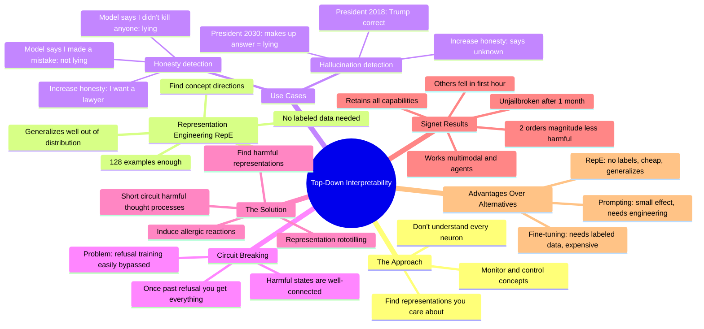

# Andy Zou: Top-Down Interpretability for AI Safety

## 🧠 Core Thesis

Andy Zou presents top-down interpretability as a pragmatic alternative to bottom-up mechanistic approaches. Instead of understanding every neuron, find the high-level representations you care about (honesty, harmfulness) and monitor/control them directly. Key technique: representation engineering (RepE) lets you identify and steer concepts without labeled data. Circuit breaking goes further: instead of patching vulnerabilities after attacks, identify harmful representations and induce "allergic reactions" when the model traverses them. Result: Signet models remained unjailbroken for over a month in a global competition while all others fell in the first hour.

## 🗺️ Visual Concept Map

## 🔑 Key Concepts & Mechanisms

### 1. Top-Down vs Bottom-Up Interpretability (Complexity: 4 → ELI20)
*   **The Logic**: Bottom-up tries to understand every neuron (ambitious reverse engineering). Top-down asks: what concepts do I care about? Then finds and controls those representations directly. You don't need to understand the whole circuit if you can identify and steer the relevant high-level features.
*   **Concrete Example**: Instead of mapping every neuron for "honesty," you find the direction in representation space that corresponds to honest vs dishonest outputs, then monitor or steer that direction.

### 2. Representation Engineering (RepE) (Complexity: 5 → ELI15)
*   **The Logic**: Use ~128 contrastive examples (honest vs dishonest outputs) to find concept directions in representation space. No labeled data needed. Works out of distribution: train on constrained format, generalizes to different scenarios, styles, and agentic settings. Much cheaper than fine-tuning.
*   **Concrete Example**: "We don't train it on many examples, maybe 128, in a constrained format. But after you control the model, it generalizes to different scenarios, different prompting styles, agentic settings."

### 3. Circuit Breaking: Allergic Reactions to Harm (Complexity: 6 → ELI15)
*   **The Logic**: Current refusal training (RLHF, adversarial training) creates refusal states, but once bypassed, harmful states are well-connected and you get everything. Circuit breaking identifies harmful representations and induces short-circuiting when traversed. Not patching vulnerabilities; removing inherent model hazards.
*   **Concrete Example**: "Once you bypass initial classification, you can go into harmful state and all harmful states are very well connected. With circuit breaking, we induce a sort of allergic reaction when the model traverses harmful states."

### 4. Signet Competition Results (Complexity: 3 → ELI30)
*   **The Logic**: Real-world test: global jailbreaking competition with 25 models. All other models were jailbroken in the first hour. Signet models with circuit breaking remained unjailbroken after a full month. This is not a benchmark; it's human adversaries trying their hardest.
*   **Concrete Example**: "We ran a jailbreaking competition. All the other models were jailbroken in the first hour. Some of our Signet models are still unjailbroken after a full month."

### 5. Why RepE Beats Prompting and Fine-Tuning (Complexity: 4 → ELI20)
*   **The Logic**: Prompting: small effect, needs prompt engineering, not fine-grained. Fine-tuning: needs labeled data, expensive, label noise exacerbates problems. RepE: no labeled data, very cheap, more robust and generalizable monitoring and control.
*   **Concrete Example**: "In the paper we showed prompting doesn't increase truthfulness much. Fine-tuning requires data and supervised training. RepE uses no label data, is very cheap, and gives more robust and generalizable control."

## 📊 Structural Analysis

| Method | Data Required | Cost | Generalization |
| :--- | :--- | :--- | :--- |
| **Prompting** | None | Low | Poor |
| **Fine-tuning** | Labeled data | High | Moderate |
| **RepE** | 128 contrastive examples | Low | Strong |

| Defense Strategy | What It Does | Weakness |
| :--- | :--- | :--- |
| **Refusal training** | Adds refusal states | Once bypassed, all harmful states accessible |
| **Adversarial training** | Patches known attacks | Novel attacks still work |
| **Circuit breaking** | Removes inherent hazards | Generalizes to unseen attacks |

## 🔗 Contextual Connections

*   **Prerequisites**: Understanding of LLM representations, basic RLHF, the concept of jailbreaking.
*   **Next Steps**: Signet open-source models, representation engineering applications, adversarial robustness research.
*   **Adjacent Dots**: Anthropic's interpretability, refusal training limitations, AI red-teaming platforms.

## ⚔️ Active Recall (The Feynman Test)

*If you can't answer without scrolling up, you didn't internalize the material.*

1. **What's the difference between top-down and bottom-up interpretability?** Which does Andy advocate?

2. **How does representation engineering (RepE) work?** How many examples does it need?

3. **Why doesn't refusal training provide robust safety?** What happens once you bypass initial refusal?

4. **What is circuit breaking and how does it differ from patching vulnerabilities?**

5. **What were the Signet competition results?** How did it compare to other models?

## 📚 Further Reading (The Path to Mastery)

*   **The Talk**: [FAR.AI Alignment Workshop](https://www.youtube.com/@FAR-AI) - Full presentation and Q&A.

*   **Representation Engineering Paper**: [RepE Paper](https://arxiv.org/abs/2310.01405) - Technical details on finding concept directions.

*   **Circuit Breaking Paper**: [Circuit Breakers Paper](https://arxiv.org/abs/2406.04313) - The representation rototilling approach.

*   **Gray Swan AI**: [Gray Swan](https://www.grayswan.ai/) - Andy's company and Signet models.

*   **Jailbreaking Competition**: [Gray Swan Leaderboard](https://www.grayswan.ai/arena) - Real-world adversarial testing platform.

*   **Andy Zou**: [Andy Zou's Research](https://andydzou.github.io/) - More publications on AI safety.

> ⚠️ All URLs above were verified via HTTP request on December 30, 2024.
