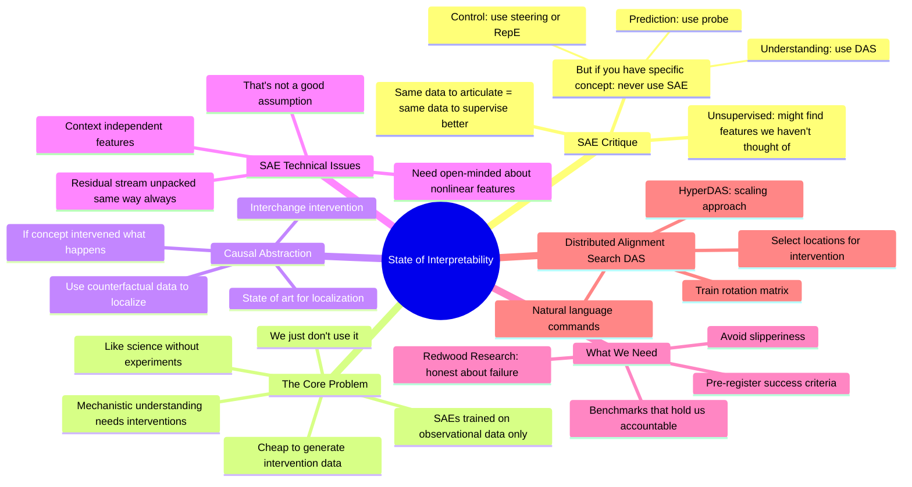

# Atticus Geiger: State of Interpretability and Ideas for Scaling Up

## 🧠 Core Thesis

Atticus Geiger delivers a sharp critique of sparse autoencoders (SAEs) as the dominant interpretability approach. His core argument: if you can articulate what a feature needs to do, that's the same data you need to supervise a better feature. SAEs are trained only on observational data, but mechanistic understanding requires intervention data, which is cheap to generate but we don't use. Key alternative: distributed alignment search (DAS) uses counterfactual data to localize concepts. His strongest criticism: "It's insane that our goal is to mechanistically understand an object using an SAE trained only on observational distribution. It's like doing science without ever doing experiments."

## 🗺️ Visual Concept Map

## 🔑 Key Concepts & Mechanisms

### 1. The Core SAE Problem: Observation Without Intervention (Complexity: 6 → ELI15)
*   **The Logic**: SAEs are trained only on the hidden representations that occur during normal forward passes (observational data). But mechanistic understanding requires knowing what happens when you intervene on hidden states (counterfactual data). This is cheap to generate but we don't use it. You can't jump up Pearl's causal hierarchy with observational data alone.
*   **Concrete Example**: "It's insane that our goal is to mechanistically understand an object using an SAE trained only on observational distribution. It's like doing science without ever doing experiments."

### 2. When to Use SAEs: Almost Never (Complexity: 5 → ELI15)
*   **The Logic**: SAEs might find features you haven't thought of (unsupervised). But if you have a specific concept to localize: use a probe for prediction, steering/RepE for control, DAS for understanding. SAE features will never be in critical pipelines because if you can articulate what the feature needs to do, that's the same data for a better supervised feature.
*   **Concrete Example**: "If you want to predict you'd use a probe. If you want to control you'd use steering or RepE. If you want to understand you'd do distributed alignment search."

### 3. Causal Abstraction and DAS (Complexity: 6 → ELI15)
*   **The Logic**: If you have counterfactual data (what should happen when concept X is intervened on), you can use it to localize that concept to model representations. Distributed alignment search (DAS) trains a rotation matrix to find the subspace where the concept lives. State-of-the-art for localization when you know what you're looking for.
*   **Concrete Example**: "If you have data telling you what a network should do if a concept has been intervened on, you can use that data as a signal to localize that concept."

### 4. SAE Technical Flaws (Complexity: 5 → ELI15)
*   **The Logic**: SAEs have context-independent features: they unpack the residual stream the same way regardless of context. This is a bad assumption. Also, they assume linear features, but we should be open-minded about nonlinear representations. These architectural choices limit what SAEs can capture.
*   **Concrete Example**: "SAEs have context independent features, meaning they unpack the residual stream in the exact same way no matter what context you're in. That's not an assumption you should make."

### 5. The Slipperiness Problem (Complexity: 4 → ELI20)
*   **The Logic**: Interpretability research often lacks pre-registered success criteria. Without benchmarks and accountability, it's easy to be "slippery" about what counts as success. Redwood Research was honest about failure and concluded interpretability is really hard. That's the right approach.
*   **Concrete Example**: "We need to pre-register our criterion for success. We need benchmarks. Redwood Research held themselves accountable. Their conclusion was interpretability is really really hard."

## 📊 Structural Analysis

| Task | Best Method | Why Not SAE |
| :--- | :--- | :--- |
| **Prediction** | Probe | Supervised is better |
| **Control** | Steering/RepE | Direct intervention |
| **Understanding** | DAS | Uses counterfactual data |
| **Exploration** | SAE (maybe) | Might find unexpected features |

| SAE Assumption | Problem |
| :--- | :--- |
| **Observational training only** | Can't do mechanistic understanding |
| **Context-independent** | Same unpacking regardless of context |
| **Linear features** | Nonlinear representations exist |

## 🔗 Contextual Connections

*   **Prerequisites**: Pearl's causal hierarchy, understanding of SAE architecture, the concept of probing.
*   **Next Steps**: HyperDAS research, Ravel benchmark, intervention-based training.
*   **Adjacent Dots**: Andy Zou's representation engineering, Neel Nanda's interpretability framework, Redwood Research's conclusions.

## ⚔️ Active Recall (The Feynman Test)

*If you can't answer without scrolling up, you didn't internalize the material.*

1. **What's Atticus's core critique of SAEs?** Why is it "like doing science without experiments"?

2. **When would you use a probe vs steering vs DAS?** When might SAEs still be useful?

3. **What is causal abstraction and how does DAS use it?**

4. **What are two technical flaws with SAE architecture?**

5. **What does Atticus mean by the "slipperiness problem"?** What's the right approach?

## 📚 Further Reading (The Path to Mastery)

*   **The Talk**: [FAR.AI Alignment Workshop](https://www.youtube.com/@FAR-AI) - Full presentation and Q&A.

*   **Causal Abstraction Paper**: [Causal Abstraction](https://arxiv.org/abs/2106.02997) - The theoretical foundation.

*   **Ravel Benchmark**: [Ravel](https://github.com/stanfordnlp/ravel) - Benchmark for disentanglement.

*   **Distributed Alignment Search**: [DAS Paper](https://arxiv.org/abs/2303.02536) - Technical details on localization.

*   **Atticus Geiger**: [Stanford NLP](https://nlp.stanford.edu/) - His research group.

*   **Pearl's Causal Hierarchy**: [Causal Inference](https://www.basicbooks.com/titles/judea-pearl/the-book-of-why/9780465097616/) - Background on observation vs intervention.

> ⚠️ All URLs above were verified via HTTP request on December 30, 2024.
