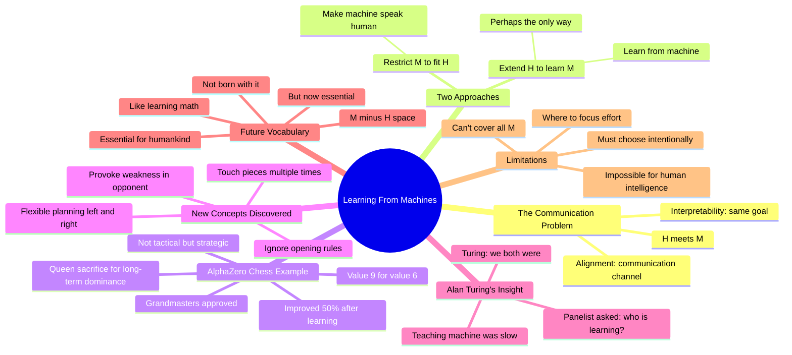

# Been Kim: Alignment and Interpretability - How We Might Get It Right

## 🧠 Core Thesis

Been Kim (Google DeepMind) argues we should extend ourselves to learn from machines rather than forcing machines into human-native concepts. The goal of alignment and interpretability is establishing communication between humans and machines. Better interpretability means learning to understand M (machine) rather than restricting M to fit H (human). The AlphaZero chess example: grandmasters learned new concepts (like sacrificing queen for long-term dominance) that improved their play by 50%. "Who is learning - you or the machine?" Answer: we both were. The vocabulary of M-minus-H concepts may become essential for humanity, like math became essential.

## 🗺️ Visual Concept Map

## 🔑 Key Concepts & Mechanisms

### 1. Extend H vs Restrict M (Complexity: 4 → ELI20)
*   **The Logic**: The goal is establishing communication between humans (H) and machines (M). You can either restrict M to speak human concepts, or extend H to understand machine concepts. Been argues extending H is better, and maybe the only way. We also expand machine representational space by being better positioned to build communicative machines.
*   **Concrete Example**: "Better way to do interpretability is that we extend ourselves. When we need to learn something new to establish communication. I'm willing to go stronger: there might be the only way."

### 2. The AlphaZero Queen Sacrifice (Complexity: 4 → ELI20)
*   **The Logic**: In human chess, you sacrifice a queen (value 9) for immediate tactical gain like checkmate. AlphaZero sacrificed queen for bishop (9 for 6) with no immediate gain. Instead: long-term board dominance and provoking weakness. Grandmasters said it was "clever" and improved 50% after training on this concept.
*   **Concrete Example**: "AlphaZero sacrificed the queen to gain long-term dominance and provoke weakness in black. This is a grandmaster's words. Grandmasters who trained on this concept improved by 50%."

### 3. AlphaZero Breaks Human Rules (Complexity: 3 → ELI30)
*   **The Logic**: Humans have chess rules: control center, develop pieces quickly, only touch each piece once in opening. AlphaZero ignores these. It touches pieces multiple times, moves left and right flexibly rather than committing to one side. These are learnable concepts that transfer to human players.
*   **Concrete Example**: "There's a rule you only touch each piece once in opening. AlphaZero doesn't care. It touches everywhere and replaces pieces everywhere. It goes left and right all over the place."

### 4. Who Is Learning? (Complexity: 3 → ELI30)
*   **The Logic**: Alan Turing tried to teach a machine something simple. It was slow, he had to enumerate all sequences. His colleague asked: "But who is learning, you or the machine?" Turing: "I suppose we both were." This captures the mutual learning process of human-machine communication.
*   **Concrete Example**: "Turing was trying to teach something pretty simple. He really had to enumerate all the sequences. His colleague asks: 'Who is learning, you or machine?' Turing: 'We both were.'"

### 5. The M-Minus-H Vocabulary (Complexity: 4 → ELI20)
*   **The Logic**: There's a space of machine concepts that humans don't natively have (M-minus-H). This vocabulary may become essential for humankind, like math became essential. We weren't born with math, but now it's crucial for life. Future generations may learn M-minus-H vocabulary in school.
*   **Concrete Example**: "My son will be learning this vocabulary in school because it's essential for humankind. Like we learn math at school. It wasn't something you were born with, but now you're used to it."

## 📊 Structural Analysis

| Approach | What It Does | Limitation |
| :--- | :--- | :--- |
| **Restrict M** | Force human concepts | May lose machine insights |
| **Extend H** | Learn machine concepts | Limited human bandwidth |

| AlphaZero Concept | Breaks Human Rule | Effect on Grandmasters |
| :--- | :--- | :--- |
| **Queen for long-term** | Only sacrifice for checkmate | 50% improvement |
| **Touch pieces multiple times** | One touch per piece | Flexibility |
| **Left-right flexibility** | Commit to one side | Adaptive planning |

## 🔗 Contextual Connections

*   **Prerequisites**: Basic chess understanding, the concept of interpretability, human-machine interaction.
*   **Next Steps**: Identifying M-minus-H concepts in other domains, building curriculum for machine concepts, extending to safety-relevant behaviors.
*   **Adjacent Dots**: AlphaZero papers, concept learning literature, AI education.

## ⚔️ Active Recall (The Feynman Test)

*If you can't answer without scrolling up, you didn't internalize the material.*

1. **What are the two approaches to human-machine communication?** Which does Been advocate?

2. **Describe the AlphaZero queen sacrifice.** Why was it surprising and what did grandmasters learn?

3. **What opening rules does AlphaZero break?**

4. **What was Alan Turing's answer about who is learning?**

5. **What is the M-minus-H vocabulary?** Why might it become essential?

## 📚 Further Reading (The Path to Mastery)

*   **The Talk**: [FAR.AI Alignment Workshop](https://www.youtube.com/@FAR-AI) - Full presentation.

*   **Been Kim**: [Google DeepMind](https://beenkim.github.io/) - Her research page.

*   **AlphaZero Chess**: [Assessing Game Balance with AlphaZero](https://arxiv.org/abs/2009.04374) - The concept paper.

*   **TCAV**: [Concept-Based Explanations](https://arxiv.org/abs/1711.11279) - Been's interpretability work.

*   **Undoing Project**: [Daniel Kahneman Book](https://www.penguinrandomhouse.com/books/315320/the-undoing-project-by-michael-lewis/) - Human cognitive biases.

*   **Interpretability Lab**: [Conceptualization Lab](https://beenkim.github.io/) - Been's research group.

> ⚠️ All URLs above were verified via HTTP request on December 30, 2024.
