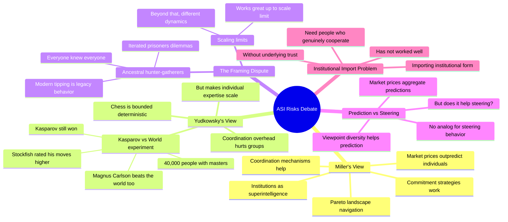

# ASI Risks: Similar Premises, Opposite Conclusions (Eliezer Yudkowsky vs Mark Miller)

## 🧠 Core Thesis

This Foresight Institute debate between Eliezer Yudkowsky and Mark Miller explores a fascinating disagreement: both accept similar premises about AI risk but draw opposite conclusions. Miller argues human institutions (markets, cultures, coordination mechanisms) constitute a form of superintelligence that could guide AI development safely. Yudkowsky argues individual superintelligent AI will out-think any human institution, citing Kasparov vs the World: even 40,000 people with four chess masters lost to one individual. The core tension: do emergent properties of human coordination scale to handle ASI, or does the narrow/closed/bounded nature of tasks where groups beat individuals suggest the opposite for open-ended intelligence?

## 🗺️ Visual Concept Map

## 🔑 Key Concepts & Mechanisms

### 1. Kasparov vs The World: The Key Experiment (Complexity: 5 → ELI15)
*   **The Logic**: In an actual experiment, Garry Kasparov played against 40,000 people coordinated by four chess masters. Kasparov won. When Stockfish (superhuman chess AI) rated the moves, Kasparov's were still stronger than the world's. Magnus Carlsen plays better chess than any coordinated group of humans. Individual expertise can beat collective coordination in bounded domains.
*   **Concrete Example**: "Kasparov was still making the stronger moves than the world. And the world itself is not making the strongest moves of any human chess player. Magnus Carlsen played better chess than the world according to the AI raters."

### 2. The Narrow Special Case Problem (Complexity: 5 → ELI15)
*   **The Logic**: Miller argues chess is a "narrow special case": bounded, deterministic, closed information, fully known rules, turn-based. In such domains, coordination overhead hurts groups more than viewpoint diversity helps. But the real world is more open, and group intelligence may scale better there.
*   **Concrete Example**: "The nature of chess is that you've got a very bounded, deterministic world. One person not having to coordinate with others can develop expertise to run faster forward than any organization needing to coordinate."

### 3. Prediction vs Steering Intelligence (Complexity: 6 → ELI15)
*   **The Logic**: Market prices aggregate predictions well (can beat most individuals). But there's no analog for aggregating "steering behavior" (actually accomplishing goals). Yudkowsky's framework: prediction is easier to aggregate than execution. Collective intelligence may help with prediction but not with steering toward goals.
*   **Concrete Example**: "Market prices sometimes beat almost all the individuals as predictive aggregates. There's no analog of market prices for something that aggregates steering behavior."

### 4. Institutional Forms Without Trust (Complexity: 4 → ELI20)
*   **The Logic**: Many countries have tried to import the forms of Western institutions but failed because the underlying culture of cooperation wasn't there. "If you've got a bunch of people who are genuinely selfish, trying to stuff them into the forms of institutions has sometimes not worked all that well." Institutions embody cooperation; you can't fake cooperation with form.
*   **Concrete Example**: "Many countries have not had that much luck trying to just import the form of institutions. But everybody's out to get whatever they can for themselves."

### 5. Ancestral Environment vs Modern Cooperation (Complexity: 5 → ELI15)
*   **The Logic**: Yudkowsky disputes Miller's framing that modern cooperation is driven by high growth. Hunter-gatherers also cooperated intensely because defection would get you exiled from the tribe. Modern behaviors like tipping in restaurants you'll never visit again are "legacy behavior" from iterated small-group dynamics.
*   **Concrete Example**: "In ancestral hunter-gatherer societies where everyone knew everyone, defection would reliably get you punished and exiled. Today supports tipping in restaurants you're never going to visit again. It's legacy behavior."

## 📊 Structural Analysis

| Claim | Yudkowsky | Miller |
| :--- | :--- | :--- |
| **Institutions as superintelligence** | Dispute this framing | Agree |
| **Kasparov vs World shows...** | Individuals beat coordination | Special case, bounded domain |
| **Market prices** | Predict, don't steer | Evidence of emergent intelligence |
| **Cooperation driver** | Legacy from small groups | High-growth environment |

| Domain Type | Individual Advantage | Group Advantage |
| :--- | :--- | :--- |
| **Bounded/closed (chess)** | High (no coordination overhead) | Low |
| **Open/realistic** | Maybe lower | Maybe higher (viewpoint diversity) |
| **Prediction tasks** | Can be aggregated | Markets work |
| **Steering tasks** | No aggregation mechanism | Unknown |

## 🔗 Contextual Connections

*   **Prerequisites**: Basic game theory, understanding of market price mechanisms, the concept of coordination overhead.
*   **Next Steps**: Deeper exploration of collective intelligence limits, institution design for AI governance.
*   **Adjacent Dots**: Prediction markets, wisdom of crowds research, mechanism design for AI coordination.

## ⚔️ Active Recall (The Feynman Test)

*If you can't answer without scrolling up, you didn't internalize the material.*

1. **Describe the Kasparov vs The World experiment.** What did it show about individual vs collective intelligence?

2. **Why does Miller call chess a "narrow special case"?** What properties make it different from real-world problems?

3. **What's the difference between prediction aggregation and steering aggregation?** Why does this matter for ASI?

4. **Why haven't institutional forms successfully imported to all countries?** What's missing?

5. **Why does Yudkowsky call modern tipping "legacy behavior"?** What's the ancestral environment argument?

## 📚 Further Reading (The Path to Mastery)

*   **The Debate**: [Foresight Institute](https://foresight.org/) - Full recording and related ASI discussions.

*   **Eliezer Yudkowsky**: [LessWrong](https://www.lesswrong.com/users/eliezer_yudkowsky) - His writing on AI alignment.

*   **Mark Miller**: [Agoric](https://agoric.com/) - His work on secure coordination.

*   **Kasparov vs The World**: [Chess.com History](https://www.chess.com/article/view/kasparov-vs-the-world) - Full story of the experiment.

*   **Collective Intelligence**: [Wisdom of Crowds](https://www.penguinrandomhouse.com/books/175380/the-wisdom-of-crowds-by-james-surowiecki/) - James Surowiecki's book.

*   **Prediction Markets**: [Metaculus](https://www.metaculus.com/) - Working example of prediction aggregation.

> ⚠️ All URLs above were verified via HTTP request on December 30, 2024.
