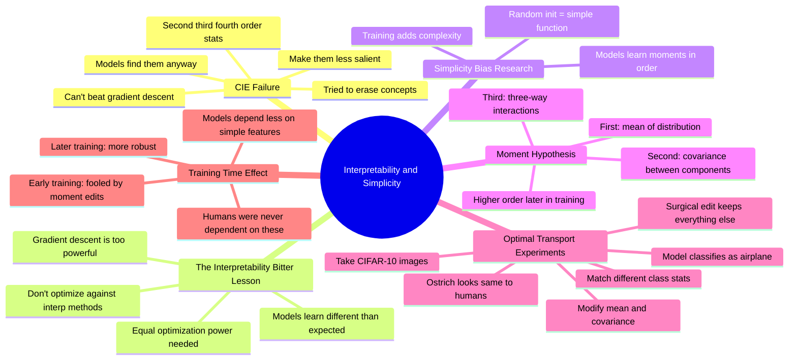

# AI Interpretability, Safety and Meaning - Nora Belrose

## 🧠 Core Thesis

Nora Belrose (EleutherAI) presents a cautionary tale about concept erasure and reveals a new research direction on simplicity bias. Key warning: if you try to optimize against interpretability methods or directly against gradient descent, you're probably going to lose. CIE (Concept Invariant Embeddings) fails because models can still learn the concept from second, third, fourth order statistics. This is the "interpretability bitter lesson." New finding: models learn moments in order. Early training: first-order (mean). Later: second-order (covariance). Even later: third/fourth order. You can fool early-training models with optimal transport edits invisible to humans.

## 🗺️ Visual Concept Map

## 🔑 Key Concepts & Mechanisms

### 1. CIE Failure: Can't Beat Gradient Descent (Complexity: 5 → ELI15)
*   **The Logic**: Concept Invariant Embeddings tried to make certain concepts less salient or harder to learn. But models can still pick up the concept from second, third, fourth order statistics. If you try to prevent gradient descent from reducing loss, you're going to lose unless you apply equal optimization power yourself.
*   **Concrete Example**: "Gradient descent is a very powerful optimizer. If you're trying to directly go against gradient descent and prevent it from accomplishing something, you're probably going to lose that battle."

### 2. The Interpretability Bitter Lesson (Complexity: 4 → ELI20)
*   **The Logic**: Don't optimize against interpretability methods. Don't directly optimize some measure of interpretability of your model. The model could learn something totally different from what you expect. You probably don't want to use CIE directly; its applications are niche and you should be careful.
*   **Concrete Example**: "You probably don't want to optimize against interpretability methods. It could just end up learning something that's like totally different from what you expect."

### 3. Simplicity Bias and Moments (Complexity: 5 → ELI15)
*   **The Logic**: Randomly initialized networks are "simple" functions. Training adds complexity. Specifically, models learn to use statistical moments in order: first moment (mean) early in training, second moment (covariance) later, third/fourth order even later. This is their contribution to the simplicity bias literature.
*   **Concrete Example**: "Early in training, predictions primarily depend on the first-order moment, the mean. Then it starts depending on covariance, then third and fourth order information later on."

### 4. Optimal Transport Editing (Complexity: 5 → ELI15)
*   **The Logic**: Using optimal transport theory, you can take an image (ostrich) and surgically edit it so its mean and covariance match a different class (airplane). The edit keeps everything else as similar as possible. To humans, the image looks the same. To early-training models, it's classified as the target class.
*   **Concrete Example**: "We've got an image of an ostrich, changed it to be an airplane. You can barely tell the difference. But early in training, classifiers very likely classify it as an airplane."

### 5. Why Humans Aren't Fooled (Complexity: 4 → ELI20)
*   **The Logic**: These edits change mean and covariance but preserve higher-order structure. Humans don't depend on these simple first/second-order statistics for classification. Neural networks, especially early in training, are sensitive to these features. This isn't adversarial (not optimizing against the model); it's showing what features matter when.
*   **Concrete Example**: "It's showing that especially early in training, these networks are sensitive to simple features that humans are much less dependent on."

## 📊 Structural Analysis

| Training Stage | Features Used | Vulnerability |
| :--- | :--- | :--- |
| **Early** | First-order (mean) | Easily fooled by mean edits |
| **Mid** | Second-order (covariance) | Fooled by covariance edits |
| **Late** | Higher-order | More robust |
| **Human** | Complex features | Never dependent on these |

| Approach | Problem |
| :--- | :--- |
| **CIE** | Models find concepts in higher-order stats |
| **Optimize against interp** | Model learns unexpected things |
| **Adversarial examples** | Optimized against model |
| **Moment editing** | Natural, not optimized |

## 🔗 Contextual Connections

*   **Prerequisites**: Basic understanding of statistical moments, what covariance means, the concept of adversarial examples.
*   **Next Steps**: Using moment analysis for interpretability, understanding training dynamics, developing robust concept removal.
*   **Adjacent Dots**: Simplicity bias literature, optimal transport theory, adversarial robustness.

## ⚔️ Active Recall (The Feynman Test)

*If you can't answer without scrolling up, you didn't internalize the material.*

1. **Why does CIE fail?** What can models still learn from?

2. **What is the "interpretability bitter lesson"?**

3. **What is the moment hypothesis?** In what order do models learn statistics?

4. **How does optimal transport editing work?** What does an edited image look like?

5. **Why aren't humans fooled by these edits?**

## 📚 Further Reading (The Path to Mastery)

*   **The Interview**: [Machine Learning Street Talk](https://www.youtube.com/@MachineLearningStreetTalk) - Full conversation.

*   **EleutherAI**: [EleutherAI](https://www.eleuther.ai/) - Nora's organization.

*   **ICML Paper**: [Simplicity Bias](https://arxiv.org/abs/2305.19252) - The moment hypothesis paper.

*   **Optimal Transport**: [Computational OT](https://pythonot.github.io/) - Background theory.

*   **CIE Work**: [Concept Erasure](https://arxiv.org/abs/2306.03819) - The original approach.

*   **Simplicity Bias Literature**: [Deep Learning Bias Survey](https://arxiv.org/abs/2006.07159) - Broader context.

> ⚠️ All URLs above were verified via HTTP request on December 30, 2024.
