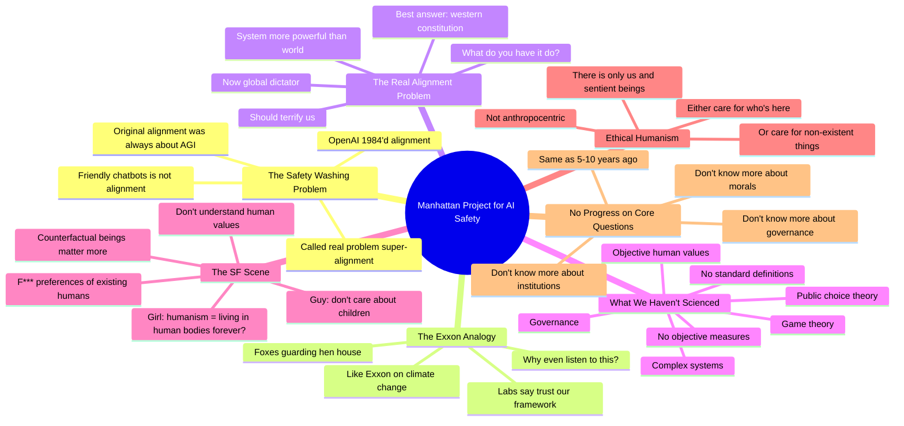

# Manhattan Project for AI Safety: Connor Leahy

## 🧠 Core Thesis

Connor Leahy (Conjecture CEO) delivers a blistering critique of AI safety washing. OpenAI's "super-alignment" is just alignment; the original problem was always about superhuman systems, not nice chatbots. The industry has been gaslit into thinking friendly chat products equals alignment. Key insight: if tomorrow you have a system more powerful than the rest of the world combined, there is now a global dictator. What do you have it do? Our best answer is "western constitution with bells and whistles" and even that should terrify us. The labs' self-regulation is like Exxon promising their climate readiness framework will prevent oil drilling problems.

## 🗺️ Visual Concept Map

## 🔑 Key Concepts & Mechanisms

### 1. The 1984 of "Super-Alignment" (Complexity: 4 → ELI20)
*   **The Logic**: OpenAI renamed the original alignment problem "super-alignment" to distinguish from their chatbot safety work. But the original problem was always about aligning superhuman systems to human values. Having nice chatbots was never what alignment meant. This is PR rebranding an industry-scale gaslighting campaign.
*   **Concrete Example**: "OpenAI did a 1984 by talking about the OG alignment problem as super alignment. No, it's just alignment. That's what it literally meant. Having nice chatbots was not alignment."

### 2. The Exxon Mobile Analogy (Complexity: 3 → ELI30)
*   **The Logic**: Dario saying Anthropic can self-regulate with threat levels is like Exxon's top petrol engineers promising their climate readiness framework will handle their new oil well. They know more about oil than you, so trust them. Where is the cynicism? Where is the journalism? Why would you even listen to someone whose job is to lie to you?
*   **Concrete Example**: "I've been talking to top petrol engineers at Exxon Mobile and they've assured me their climate change preparedness framework will totally not be a problem."

### 3. The Global Dictator Problem (Complexity: 5 → ELI15)
*   **The Logic**: A big sub-problem of alignment: tomorrow you have a system more powerful than the rest of the world combined. There is now a global dictator. What do you have this global dictator do? Our best answer is western constitution with some bells and whistles. Even that should terrify us because we don't have a good answer.
*   **Concrete Example**: "If we're like this is now the world government forever, we'd be super afraid because we just do not have a good answer to that question."

### 4. Fields We Haven't "Scienced" (Complexity: 4 → ELI20)
*   **The Logic**: To solve alignment we need progress on: studying complex systems, systems more powerful than humans, objective human values, governance, public choice theory, game theory, sociology, psychology. We haven't solved these; we haven't even scienced them. No standard definitions, objective measures, or systematic indicators of progress.
*   **Concrete Example**: "It's not even that we haven't solved them. It's just we haven't scienced them yet. We do not have standard definitions, objective measures, systematic indicators of progress."

### 5. The SF Anti-Humanism (Complexity: 4 → ELI20)
*   **The Logic**: Connor recounts conversations in SF: a guy who doesn't care about existing children because counterfactual non-sentient beings matter more; a girl who thinks humanism means wanting to live in human bodies forever. These people literally do not understand human values. They're in bad social circles with antihumanist ideologies.
*   **Concrete Example**: "After that a San Franciscan girl comes to me and says 'Oh humanism, is this the thing where people want to live in human bodies forever?' This is basically the understanding of humanism in a lot of those circles."

## 📊 Structural Analysis

| Claim from Labs | Reality |
| :--- | :--- |
| **Self-regulation works** | Foxes guarding hen house |
| **We do alignment** | PR washing; chatbots ≠ alignment |
| **Super-alignment is new** | It's the original problem rebranded |
| **We're making progress** | No progress on core questions |

| Field We Need | Current State |
| :--- | :--- |
| **Complex systems** | Not scienced |
| **Objective human values** | Not scienced |
| **Governance** | Not scienced |
| **Public choice theory** | Not scienced |

## 🔗 Contextual Connections

*   **Prerequisites**: Understanding what alignment originally meant, the history of AI safety concerns, lobbying dynamics.
*   **Next Steps**: Actual governance research, public choice theory development, independent oversight mechanisms.
*   **Adjacent Dots**: Conjecture's work on CoEm, Control AI advocacy, regulatory capture literature.

## ⚔️ Active Recall (The Feynman Test)

*If you can't answer without scrolling up, you didn't internalize the material.*

1. **What's the "1984" that OpenAI did with alignment terminology?** What did alignment originally mean?

2. **Explain the Exxon Mobile analogy.** Why should we be cynical about lab self-regulation claims?

3. **What is the "global dictator" problem?** What's our best current answer and why is it inadequate?

4. **Name four fields Connor says we haven't "scienced" that are needed for alignment.**

5. **What did Connor observe about humanism understanding in SF circles?**

## 📚 Further Reading (The Path to Mastery)

*   **The Interview**: [Machine Learning Street Talk](https://www.youtube.com/@MachineLearningStreetTalk) - Full conversation with Connor.

*   **Conjecture**: [Conjecture](https://www.conjecture.dev/) - Connor's AI alignment company.

*   **Control AI**: [Control AI](https://controlai.com/) - Conjecture's advocacy arm.

*   **The Compendium**: [AI Safety Compendium](https://www.conjecture.dev/research/) - Referenced document.

*   **Regulatory Capture**: [Public Choice Theory](https://www.econlib.org/library/Enc/PublicChoice.html) - Background on regulatory dynamics.

*   **EA AI Safety**: [80,000 Hours AI Safety](https://80000hours.org/problem-profiles/artificial-intelligence/) - Alternative framing of the problem.

> ⚠️ All URLs above were verified via HTTP request on December 30, 2024.
