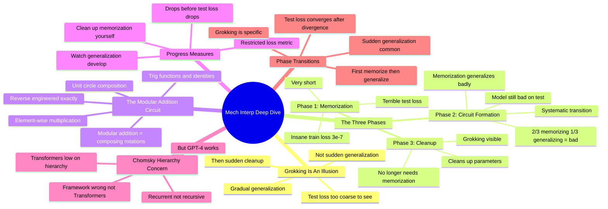

# Mechanistic Interpretability - NEEL NANDA DeepMind (MLST 4-Hour Interview)

## 🧠 Core Thesis

The definitive Neel Nanda interview. Key revelation: grokking is an illusion. The model doesn't suddenly generalize; it gradually transitions from memorization to generalization, then suddenly cleans up the memorization noise. Three phases: memorization (insane train loss, terrible test), circuit formation (systematic transition, still bad test because memorization generalizes badly), cleanup (grokking visible). Progress measures using mechanistic understanding showed that restricted loss (cleaning up memorization) drops before test loss, proving generalization was gradual. Also discussed: the Chomsky hierarchy worry is probably wrong because GPT-4 works.

## 🗺️ Visual Concept Map

## 🔑 Key Concepts & Mechanisms

### 1. Grokking Is Gradual Then Sudden Cleanup (Complexity: 5 → ELI15)
*   **The Logic**: The mystery isn't that the model memorizes then generalizes. It's that it first memorizes well, then changes its mind to generalize. Mechanistic analysis revealed: generalization develops gradually during circuit formation, but test loss doesn't drop because memorization generalizes terribly. The sudden drop happens when the model cleans up memorization parameters.
*   **Concrete Example**: "Grokking was an illusion. It was not sudden generalization. It was gradual generalization followed by sudden cleanup. Test loss was just too coarse to tell the difference."

### 2. The Three Phases (Complexity: 5 → ELI15)
*   **The Logic**: Phase 1 (Memorization): insane train loss (3e-7), terrible test. Phase 2 (Circuit Formation): systematic transition, train gets worse when only allowed to memorize, test still bad because 2/3 memorizing + 1/3 generalizing = bad generalization. Phase 3 (Cleanup): model no longer needs memorization parameters, cleans them up, grokking becomes visible.
*   **Concrete Example**: "When the model is 2/3 memorizing and 1/3 generalizing, this still does terribly on test. Only when it gets so good at generalizing it no longer needs memorization and cleans it up do we see grokking."

### 3. The Modular Addition Algorithm (Complexity: 6 → ELI15)
*   **The Logic**: Modular addition is equivalent to composing rotations around the unit circle. Composition adds angles, circle gives modularity. You can represent this with trig functions and do composition with trig identities and element-wise multiplication. They reverse engineered exactly how the model learned to do this.
*   **Concrete Example**: "Modular addition is equivalent to composing rotations around the unit circle. Composition adds the angles. Circle gives you modularity. You can represent this with trig functions."

### 4. Progress Measures from Mechanistic Understanding (Complexity: 5 → ELI15)
*   **The Logic**: They created "restricted loss" that explicitly cleans up memorization and measures pure generalization. This metric drops noticeably before test loss drops, proving the sudden drop is about cleanup not generalization. You could only design this metric with mechanistic understanding.
*   **Concrete Example**: "Restricted loss drops noticeably before test loss drops, showing that the drop is driven by cleaning up the noise."

### 5. The Chomsky Hierarchy Objection (Complexity: 4 → ELI20)
*   **The Logic**: Transformers are low on the Chomsky hierarchy (recurrent not recursive). Theoretically they can't recognize certain language classes. But GPT-4 works amazingly well. Neel's view: if your theoretical framework says transformers are doomed and then GPT-4 happens, your framework is wrong, not transformers.
*   **Concrete Example**: "If you think there's some beautiful structure of algorithms and GPT-4 comes along, I think your framework's wrong rather than Transformers wrong."

## 📊 Structural Analysis

| Phase | Train Loss | Test Loss | What's Happening |
| :--- | :--- | :--- | :--- |
| **Memorization** | Perfect (3e-7) | Terrible | Memorization only |
| **Circuit Formation** | Still good | Still bad | Gradual transition |
| **Cleanup** | Good | Suddenly good | Memorization removed |

| Mystery | Old Answer | New Answer |
| :--- | :--- | :--- |
| **Why sudden jump?** | Luck/random walk | Gradual then cleanup |
| **What changes at grokking?** | Generalization starts | Memorization ends |
| **Can we predict it?** | No | Yes, restricted loss |

## 🔗 Contextual Connections

*   **Prerequisites**: Understanding of train/test split, what overfitting means, basic neural network training.
*   **Next Steps**: Studying phase transitions in other models, developing progress measures for other phenomena, understanding cleanup dynamics.
*   **Adjacent Dots**: The ICLR grokking paper, modular addition circuits, phase transitions in deep learning.

## ⚔️ Active Recall (The Feynman Test)

*If you can't answer without scrolling up, you didn't internalize the material.*

1. **What is the illusion behind grokking?** What's actually happening?

2. **Describe the three phases of grokking.**

3. **How does the model implement modular addition?**

4. **What is restricted loss and what did it show?**

5. **Why isn't Neel worried about the Chomsky hierarchy objection?**

## 📚 Further Reading (The Path to Mastery)

*   **The Interview**: [Machine Learning Street Talk](https://www.youtube.com/@MachineLearningStreetTalk) - Full 4-hour conversation.

*   **Grokking Paper**: [Progress Measures for Grokking](https://arxiv.org/abs/2301.05217) - The mechanistic analysis.

*   **Original Grokking**: [Power et al](https://arxiv.org/abs/2201.02177) - Initial discovery.

*   **Neel Nanda**: [Blog](https://www.neelnanda.io/) - More interpretability work.

*   **Modular Addition**: [Circuit Analysis](https://www.lesswrong.com/posts/N6WM6hs7RQMKDhYjB/a-mechanistic-interpretability-analysis-of-grokking) - Detailed writeup.

*   **TransformerLens**: [GitHub](https://github.com/TransformerLensOrg/TransformerLens) - Toolkit for this analysis.

> ⚠️ All URLs above were verified via HTTP request on December 30, 2024.
