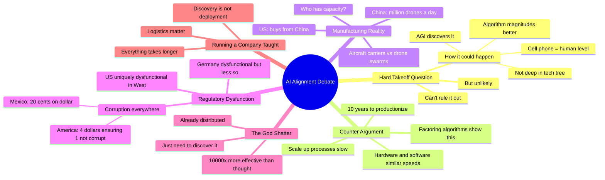

# The AI Alignment Debate: Can We Develop Truly Beneficial AI?

## 🧠 Core Thesis

A panel debate on AI alignment covering hard takeoff, manufacturing capacity, and regulatory dysfunction. Key disagreement: hard takeoff plausibility. One view: the only way it could happen is if there's an algorithm magnitudes better than anything we have, and a cell phone could achieve human-level AI. We just haven't found it. A superintelligence might find it. Counter-view: production and scale-up takes years; factoring algorithms show hardware and software progress at similar speeds. Also discussed: US vs China manufacturing capacity (China makes a million drones a day, US buys from China), and American regulatory dysfunction vs German dysfunction.

## 🗺️ Visual Concept Map

## 🔑 Key Concepts & Mechanisms

### 1. Hard Takeoff Plausibility (Complexity: 4 → ELI20)
*   **The Logic**: Can't rule out hard takeoff entirely. How it could happen: there are algorithms magnitudes of order better than anything we have, and human-level AI needs only cell phone compute. This algorithm isn't deep in the tech tree; we just haven't picked it up. An AGI system discovers it. But this seems unlikely.
*   **Concrete Example**: "The way I think it could happen is if there are algorithms magnitudes of order better than anything we ever have, and the actual compute you need to get human is like a cell phone."

### 2. The Production Bottleneck (Complexity: 4 → ELI20)
*   **The Logic**: Discovery is not deployment. Even if you find something revolutionary, it takes 10 years to productionize and scale up processes. Running a company teaches this: everything takes way longer than expected. Hardware and software progress at similar speeds (look at factoring algorithms). A 10^6 to 10^9 magical improvement seems implausible.
*   **Concrete Example**: "It's going to take so many years. It's not about the discovery. Give it 10 years to productionize and scale up processes."

### 3. Manufacturing Capacity Gap (Complexity: 3 → ELI30)
*   **The Logic**: If the future is fought with AI swarm drone warfare, who has more drone-building capacity? China can make a million drones a day. The US can make... unclear, possibly we buy them from China. Aircraft carriers may become obsolete. Manufacturing capacity matters more than individual system capability.
*   **Concrete Example**: "The Chinese can make a million drones a day and the US can make, I don't even know, I think we buy them from China."

### 4. Comparative Dysfunction (Complexity: 3 → ELI30)
*   **The Logic**: The US is uniquely dysfunctional in the West. Germany is dysfunctional but nothing compared to the US. Different types of corruption: in Mexico, you pay 20 cents on every dollar for a building. In America, every dollar goes to the building because you spent four dollars making sure the first dollar wasn't spent corruptly.
*   **Concrete Example**: "In America every dollar is spent absolutely on that building because we spent four dollars making sure that first dollar was not spent corruptly."

### 5. The God Shatter Scenario (Complexity: 5 → ELI15)
*   **The Logic**: Potentially plausible version of hard takeoff: the "god shatter" is already distributed. It's not about using all compute in the world; it turns out existing compute was 10,000x more effective than we thought. Mix lead and copper, get a superconductor. Something that simple, that transformative.
*   **Concrete Example**: "The god shatter is already distributed. It's not a question of using all the existing compute. It just turns out it was 10,000x more effective than we thought."

## 📊 Structural Analysis

| Position | Argument | Counter |
| :--- | :--- | :--- |
| **Hard takeoff possible** | Unknown algorithms exist | Production takes 10 years |
| **Cell phone = AGI** | We haven't found algorithm | Not in tech tree yet |
| **Manufacturing gap** | China makes drones | US has other capabilities |
| **US dysfunction** | Unique in West | Germany also dysfunctional |

| Factor | US | China |
| :--- | :--- | :--- |
| **Drone manufacturing** | Unknown/imports | Million per day |
| **Corruption style** | Meta-bureaucratic | Direct |
| **Regulatory efficiency** | Low | Unknown |

## 🔗 Contextual Connections

*   **Prerequisites**: Basic understanding of AI development timelines, manufacturing economics, regulatory systems.
*   **Next Steps**: Studying manufacturing capacity in detail, understanding AI deployment bottlenecks, geopolitical AI race dynamics.
*   **Adjacent Dots**: Foom debate, AI arms race, national AI strategies.

## ⚔️ Active Recall (The Feynman Test)

*If you can't answer without scrolling up, you didn't internalize the material.*

1. **How does one panelist say hard takeoff could happen?**

2. **Why does the other panelist think hard takeoff is unlikely?**

3. **What's the drone manufacturing comparison between US and China?**

4. **What's the difference in corruption styles between Mexico and America?**

5. **What is the "god shatter" scenario?**

## 📚 Further Reading (The Path to Mastery)

*   **The Debate**: [Machine Learning Street Talk](https://www.youtube.com/@MachineLearningStreetTalk) - Full panel discussion.

*   **Foom Debate**: [Yudkowsky-Hanson](https://www.lesswrong.com/posts/6Fn5k9SfWLZbjRtGK/ai-foom-debate) - Original hard takeoff debate.

*   **AI Race Dynamics**: [80,000 Hours](https://80000hours.org/problem-profiles/artificial-intelligence/) - Geopolitical considerations.

*   **Manufacturing Analysis**: [Epoch AI](https://epochai.org/) - Production capacity research.

*   **Factoring Algorithms**: [Algorithmic Progress](https://epochai.org/blog/algorithmic-progress-in-computer-vision) - Hardware vs software parity.

*   **National AI Strategies**: [CSET Georgetown](https://cset.georgetown.edu/) - Policy analysis.

> ⚠️ All URLs above were verified via HTTP request on December 30, 2024.
