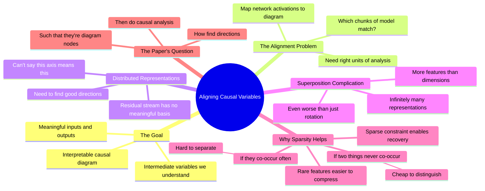

# Aligning Causal Variables and Distributed Representations - Walkthrough with Atticus Geiger

## 🧠 Core Thesis

Neel Nanda and Atticus Geiger walk through the paper title word by word. The core challenge: you have an interpretable causal diagram (algorithm with meaningful variables) and you want to find alignment between this diagram and a neural network. The problem: residual streams don't have a meaningful basis. There's no "this axis means this." You need to find the right directions. It's even worse: there's superposition (more features than dimensions). The paper answers: how do you find directions in a network such that they can be nodes in your interpretable diagram?

## 🗺️ Visual Concept Map

## 🔑 Key Concepts & Mechanisms

### 1. Interpretable Causal Diagrams (Complexity: 5 → ELI15)
*   **The Logic**: You have an algorithm with meaningful inputs, intermediate variables, and outputs. You know what each piece means. You want to find how this maps to what a neural network is doing internally. The diagram is what you believe the computation should look like; the network is what it actually does.
*   **Concrete Example**: "We have interpretable causal variables and diagrams. Some algorithm where we have meaningful inputs and compute intermediate variables that we know what they mean."

### 2. The Alignment Problem (Complexity: 5 → ELI15)
*   **The Logic**: To map your diagram to the network, you need to know which chunks of the model correspond to which variables. But you can't just pick axes in the residual stream, because there's no meaningful basis. You need to find the right directions. This paper develops rigorous methods for this alignment.
*   **Concrete Example**: "If you want to take a model's residual stream, there's not a meaningful basis where you can just be like this axis, this axis, this axis are the right units."

### 3. Why Residual Streams Have No Basis (Complexity: 5 → ELI15)
*   **The Logic**: The residual stream is shared memory that accumulates everything. Unlike neurons after nonlinearities, there's no reason any particular axis should be meaningful. You need to find the right rotation to make things interpretable. The superposition hypothesis says models compress more features than dimensions, making this even harder.
*   **Concrete Example**: "The residual stream should not obviously have neurons be the right units of analysis. It's like shared memory that accumulates everything."

### 4. Superposition Makes It Worse (Complexity: 6 → ELI15)
*   **The Logic**: If models had exactly as many features as neurons, they'd want features aligned with neurons (for nonlinearity independence). But the superposition hypothesis says models compress more features than dimensions. This means directions aren't orthogonal, they interfere, and there are infinitely many ways to represent any given vector. Finding the right directions becomes much harder.
*   **Concrete Example**: "When you have more directions than you have dimensions, there are infinitely many ways to represent a given vector as a linear combination. Math theorem just says there are infinitely many."

### 5. Sparsity as Constraint (Complexity: 5 → ELI15)
*   **The Logic**: If features are sparse (rare), two features rarely co-occur. Distinguishing which is active becomes cheap when only one is on. This is the only reason superposition might be solvable. Sparsity gives you a constraint: the representation must be a sparse combination. This lets you potentially recover the meaningful directions.
*   **Concrete Example**: "If you say it has to be a sparse combination, this is now a constraint. This can let you figure out how the vector is represented in terms of these directions."

## 📊 Structural Analysis

| Problem Layer | Why It's Hard |
| :--- | :--- |
| **No meaningful basis** | Residual stream has no preferred axes |
| **Need right rotation** | Must find interpretable directions |
| **Superposition** | More features than dimensions |
| **Infinite representations** | Many ways to decompose any vector |
| **Sparsity helps** | Constrains the space of solutions |

| Concept | Meaning |
| :--- | :--- |
| **Causal variable** | Interpretable node in algorithm |
| **Alignment** | Mapping network to diagram |
| **Distributed representation** | Features across multiple directions |
| **Superposition** | More features than dimensions |

## 🔗 Contextual Connections

*   **Prerequisites**: Understanding of residual streams, what a causal diagram is, the concept of basis and rotation.
*   **Next Steps**: Using DAS to find alignments, understanding superposition recovery methods, applying to circuits.
*   **Adjacent Dots**: Toy models of superposition, sparse autoencoders, causal abstraction work.

## ⚔️ Active Recall (The Feynman Test)

*If you can't answer without scrolling up, you didn't internalize the material.*

1. **What is an interpretable causal diagram?** What are you trying to align it to?

2. **Why doesn't the residual stream have a meaningful basis?**

3. **What additional problem does superposition create?**

4. **Why are there infinitely many ways to represent a vector when you have superposition?**

5. **How does sparsity help constrain the problem?**

## 📚 Further Reading (The Path to Mastery)

*   **The Walkthrough**: [Neel Nanda YouTube](https://www.youtube.com/@neaborative) - Full paper discussion.

*   **The Paper**: [Aligning Causal Variables](https://arxiv.org/abs/2303.02536) - The original work.

*   **Atticus Geiger**: [Stanford NLP](https://atticusg.github.io/) - Co-author's research.

*   **Causal Abstraction**: [Geiger et al](https://arxiv.org/abs/2106.02997) - Background theory.

*   **Toy Models**: [Superposition Paper](https://transformer-circuits.pub/2022/toy_model/index.html) - Why superposition exists.

*   **Sparse Autoencoders**: [Anthropic](https://www.anthropic.com/research/towards-monosemanticity) - Recovery methods.

> ⚠️ All URLs above were verified via HTTP request on December 30, 2024.
