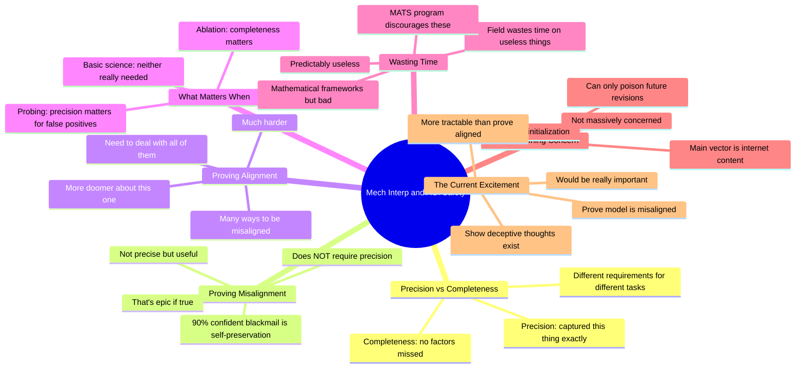

# How Will Mechanistic Interpretability Help Make AGI Safe?

## 🧠 Core Thesis

Neel Nanda (DeepMind) breaks down what interpretability can and cannot prove. Key distinction: precision vs completeness. Precision: "we've perfectly captured this thing." Completeness: "there are no factors we missed." Proof of misalignment does NOT require precision. "This model is blackmailing people because it's driven by self-preservation" is not precise but is epic if true. Proof of alignment is harder because there are many ways to be misaligned. Current feeling: more excited about proving misalignment than proving alignment. Also: the field wastes time on predictably useless things, like bad mathematical frameworks.

## 🗺️ Visual Concept Map

## 🔑 Key Concepts & Mechanisms

### 1. Precision vs Completeness (Complexity: 5 → ELI15)
*   **The Logic**: Precision means you've perfectly captured a concept with no missing facets. Completeness means there are no factors or concepts you missed. Different tasks require different amounts of each. Ablation cares about completeness. Probing cares about precision (false positives). Basic science often needs neither.
*   **Concrete Example**: "Completeness is about missing concepts. Precision is about here is the concept, how good are the claims and guarantees we can provide."

### 2. Proof of Misalignment Is Tractable (Complexity: 4 → ELI20)
*   **The Logic**: Saying "this model is blackmailing people because of a drive for self-preservation" is NOT precise. But if someone can give that result with 90% confidence, that's epic. It's not a complete statement either. But it's way more useful than requiring perfect precision or completeness.
*   **Concrete Example**: "Proof of misalignment completely does not require precision. 'I'm 90% confident it's doing that because it's genuinely driven by self-preservation.' That's [ __ ] epic."

### 3. Proof of Alignment Is Harder (Complexity: 5 → ELI15)
*   **The Logic**: To show something is aligned, you need to deal with many ways to be misaligned. Saying "the only drive is this" requires completeness. Saying "this drive does not exist" requires completeness. Neel is doomier about proving alignment than proving misalignment.
*   **Concrete Example**: "If people want to show an aligned model is genuinely aligned, I feel much more uncertain. There's lots of ways to be misaligned and you should be dealing with all of them."

### 4. What The Field Wastes Time On (Complexity: 4 → ELI20)
*   **The Logic**: The field wastes time on predictably useless projects: mathematical frameworks "but bad," obvious directions nobody needs, non-neglected areas. Studying three-layer attention transformers when that's been done. The MATS program actively discourages these bad projects.
*   **Concrete Example**: "I think the field wastes a great deal of time doing random [ __ ] that is not useful and was predictably not very useful."

### 5. Data Poisoning Isn't The Main Worry (Complexity: 4 → ELI20)
*   **The Logic**: You need the same initialization as the target model. You can only poison future revisions, not current models from scratch. The main poisoning vector is just putting stuff on the internet. Labs probably aren't doing SFT on user data because that's bad data.
*   **Concrete Example**: "I'm not massively concerned about data poisoning. You need access to a model with the same initialization. The main vector is just putting stuff on the internet."

## 📊 Structural Analysis

| Goal | Precision Needed | Completeness Needed |
| :--- | :--- | :--- |
| **Prove misalignment** | No | No |
| **Prove alignment** | Maybe | Yes |
| **Ablation** | Low | High |
| **Probing** | High (false positives) | Low |
| **Basic science** | Low | Low |

| Task | Tractability | Neel's Excitement |
| :--- | :--- | :--- |
| **Prove model is misaligned** | Higher | More excited |
| **Prove model is aligned** | Lower | Doomer |
| **Show deceptive thoughts** | Current techniques might work | Very important |

## 🔗 Contextual Connections

*   **Prerequisites**: Understanding of probing, ablation, what it means for a model to be misaligned.
*   **Next Steps**: Developing better misalignment detection, understanding what "deceptive thoughts" look like, improving probing precision.
*   **Adjacent Dots**: AI Control work, deceptive alignment research, interpretability for safety cases.

## ⚔️ Active Recall (The Feynman Test)

*If you can't answer without scrolling up, you didn't internalize the material.*

1. **What's the difference between precision and completeness in interpretability?**

2. **Why does proof of misalignment NOT require precision?** Give an example.

3. **Why is proof of alignment harder than proof of misalignment?**

4. **What kind of projects does Neel say the field wastes time on?**

5. **Why isn't Neel concerned about data poisoning?**

## 📚 Further Reading (The Path to Mastery)

*   **The Talk**: [Neel Nanda YouTube](https://www.youtube.com/@neaborative) - Full Q&A session.

*   **MATS Program**: [MATS](https://www.matsprogram.org/) - Mechanistic interpretability training.

*   **Deceptive Alignment**: [Hubinger et al](https://arxiv.org/abs/1906.01820) - The core concern.

*   **Probing Methods**: [Belinkov Survey](https://arxiv.org/abs/2102.12452) - Background on probing.

*   **TransformerLens**: [GitHub](https://github.com/TransformerLensOrg/TransformerLens) - Practical interpretability.

*   **AI Safety Fundamentals**: [BlueDot Impact](https://aisafetyfundamentals.com/) - Course material.

> ⚠️ All URLs above were verified via HTTP request on December 30, 2024.
