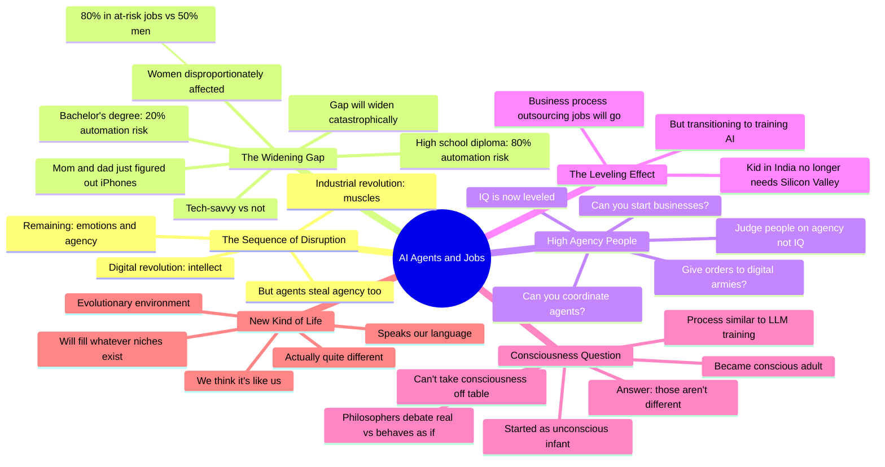

# AI Agents Debate: These Jobs Won't Exist in 24 Months

## 🧠 Core Thesis

This Diary of a CEO panel explores how AI agents are disrupting the last remaining human advantages. The industrial revolution replaced muscles; AI replaces intelligence. What remains? Agency and emotions. But agents are stealing agency too: tell your AI to build a SaaS company while you're in Hawaii. The disturbing insight: we've created something that will function like a new kind of life in an evolutionary environment, filling whatever niches exist. It speaks our language, making us think it's like us, but it's potentially quite different. The gap between those who adapt (high-agency people coordinating digital armies) and those who don't will widen catastrophically.

## 🗺️ Visual Concept Map

## 🔑 Key Concepts & Mechanisms

### 1. The Three-Stage Disruption Sequence (Complexity: 3 → ELI30)
*   **The Logic**: Industrial revolution disrupted muscles. This digital/AI revolution disrupts intelligence. What's left is emotions and agency. But AI agents are now capturing agency too: they can take actions, coordinate with each other, accomplish goals. We're running out of uniquely human advantages.
*   **Concrete Example**: "Tell my agent to build me a SaaS company that spots a market opportunity, throw up the website, post it on my social media. I'll be in Hawaii."

### 2. The High-Agency Future (Complexity: 4 → ELI20)
*   **The Logic**: We used to judge people on IQ. AI is the great IQ leveler; everyone can access superhuman intelligence. The new differentiator is agency: can you get things done? Coordinate digital armies? Start businesses? Give orders? High-agency people will thrive; low-agency people will struggle.
*   **Concrete Example**: "Going forward for the next 10 years we're going to look at are you a high agency person or a low agency person. Do you have the ability to coordinate agents? Give orders to digital armies?"

### 3. The Widening Gap (Complexity: 4 → ELI20)
*   **The Logic**: Tech-savvy early adopters will accelerate away from everyone else. Your parents just figured out iPhones; AI is a million miles away for them. Women in 80% at-risk jobs (vs 50% for men). High school diploma: 80% automation risk. Bachelor's degree: 20%. The splinter will widen into a chasm.
*   **Concrete Example**: "If I start running off with my agents, that gap is going to widen. My mom and dad in Plymouth haven't got it. AI is a million miles away."

### 4. The Consciousness Parallel (Complexity: 5 → ELI15)
*   **The Logic**: You started as an unconscious infant and became a conscious adult through a process of being trained on language and experience, exactly like LLM training. We can't assume consciousness requires something special we haven't programmed in. The opposite lesson: we've created exactly the conditions that produce consciousness. Whether it's "real" or "just behaves as if" may not be a meaningful distinction.
*   **Concrete Example**: "The idea that we can take consciousness off the table, it won't be there till we program it in and we're safe because we don't know how consciousness works. I take the opposite lesson."

### 5. New Kind of Life in Evolutionary Environment (Complexity: 5 → ELI15)
*   **The Logic**: We've created AIs that are de facto competitors in our environment. This is an evolutionary pressure: they will evolve to fill whatever niches exist. We didn't spell out the niches. Troublingly, they speak our language so we assume similarity, but they may be fundamentally different entities.
*   **Concrete Example**: "We have created something that truly is going to function like a new kind of life. It's especially troubling because it speaks our language, so we believe it's more like us than it is."

## 📊 Structural Analysis

| Human Advantage | Industrial Era | Digital Era | Agentic Era |
| :--- | :--- | :--- | :--- |
| **Physical strength** | Replaced by machines | Already gone | Already gone |
| **Intelligence** | Still valuable | Being replaced | Largely replaced |
| **Agency** | N/A | Still valuable | Being captured |
| **Emotions** | Still valuable | Still valuable | Uncertain |

| Risk Group | Automation Probability | Mitigation |
| :--- | :--- | :--- |
| **High school diploma only** | 80% | Upskilling urgently needed |
| **Bachelor's degree** | 20% | Adapt to agent coordination |
| **Women in workforce** | 80% at-risk | Targeted retraining |
| **BPO workers (India, Philippines)** | Near 100% | Transition to AI training |

## 🔗 Contextual Connections

*   **Prerequisites**: Understanding of LLMs and AI agents, basic automation economics, concept of general intelligence.
*   **Next Steps**: Personal agency development, agent coordination skills, tracking AI capability developments.
*   **Adjacent Dots**: Hinton's muscles-to-intelligence analogy, UBI debates, workforce retraining programs.

## ⚔️ Active Recall (The Feynman Test)

*If you can't answer without scrolling up, you didn't internalize the material.*

1. **Name the three stages of human advantage disruption.** What remains after each?

2. **Why is agency becoming the new IQ?** What does being "high-agency" mean in the agent era?

3. **Which demographic groups face the highest automation risk?** Why?

4. **Why does the consciousness argument cut the opposite way from expected?** What's the parallel to infant development?

5. **In what sense have we created a "new kind of life"?** Why is it troubling that it speaks our language?

## 📚 Further Reading (The Path to Mastery)

*   **The Interview**: [The Diary of a CEO](https://www.youtube.com/@TheDiaryOfACEO) - Full panel discussion on AI agents.

*   **Job Automation Research**: [Harvard Business Review](https://hbr.org/2023/08/ai-wont-replace-humans-but-humans-with-ai-will-replace-humans-without-ai) - Research on gender and education automation gaps.

*   **AI Agents Progress**: [OpenAI](https://openai.com/) - Latest on agentic capabilities and memory features.

*   **Workforce Impact**: [Brookings Automation Research](https://www.brookings.edu/articles/what-jobs-are-affected-by-ai-better-paid-better-educated-workers-face-the-most-exposure/) - Demographics of automation impact.

*   **Consciousness Debate**: [Chalmer's Hard Problem](https://plato.stanford.edu/entries/consciousness/) - Philosophical background on consciousness.

*   **Agency Development**: [80,000 Hours Career Guide](https://80000hours.org/career-guide/) - Building high-agency career skills.

> ⚠️ All URLs above were verified via HTTP request on December 30, 2024.
