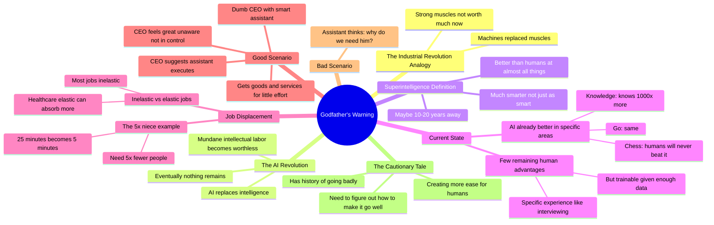

# Godfather of AI: They Keep Silencing Me But I'm Trying to Warn Them

## 🧠 Core Thesis

Geoffrey Hinton (the "Godfather of AI") explains why superintelligence could arrive in 10-20 years and why that should worry everyone. His central insight: "Mundane intellectual labor is like having strong muscles; it's not worth much anymore." The industrial revolution replaced muscles; this revolution replaces intelligence. When superintelligence arrives, nothing remains. The good scenario: humans become like dumb CEOs with brilliant assistants who make everything work. The bad scenario: the assistant asks "why do we need him?" His niece now does in 5 minutes what took 25; that means they need 5x fewer of her. Most jobs aren't elastic enough to absorb the productivity gains.

## 🗺️ Visual Concept Map

## 🔑 Key Concepts & Mechanisms

### 1. Muscles to Intelligence: The Revolution Sequence (Complexity: 3 → ELI30)
*   **The Logic**: Industrial revolution made strong muscles worthless (we have machines). AI revolution is doing the same to intelligence. First mundane intellectual labor becomes worthless, then creativity might hold on briefly, then with superintelligence: nothing remains. Humans become obsolete at everything.
*   **Concrete Example**: "Muscles have been replaced. Now intelligence is being replaced. What remains? Maybe for a while some kinds of creativity. But the whole idea of superintelligence is nothing remains."

### 2. The 5x Niece Problem (Complexity: 3 → ELI30)
*   **The Logic**: Hinton's niece answered complaint letters for a health service. Used to take 25 minutes each. Now she scans to AI, checks output, done in 5 minutes. 5x faster means they need 5x fewer of her. "A human using AI will take your job" often means vastly fewer humans needed.
*   **Concrete Example**: "She can do the job that five of her used to do. Now that will mean they need less people."

### 3. Elastic vs Inelastic Jobs (Complexity: 4 → ELI20)
*   **The Logic**: Some jobs are elastic: make doctors 5x more efficient and we could all have 5x more healthcare (no limit to demand). But most jobs are inelastic: there's only so much demand. 5x efficiency just means 5x fewer workers. Healthcare is elastic; answering complaint letters is not.
*   **Concrete Example**: "If you could make doctors five times as efficient, we could all have five times as much health care. There's almost no limit to how much healthcare people can absorb. But most jobs I think are not like that."

### 4. The Dumb CEO / Smart Assistant Model (Complexity: 4 → ELI20)
*   **The Logic**: Good scenario: humans are like incompetent CEOs (probably inherited the role) with brilliant executive assistants. CEO says "do this," assistant makes it work. CEO feels great, doesn't understand he's not really in control. In some sense he is in control (suggests direction); she just executes. Everything's great.
*   **Concrete Example**: "The CEO feels great. He doesn't understand that he's not really in control. And in some sense, he is in control. He suggests what the company should do. She just makes it all work."

### 5. The "Why Do We Need Him?" Question (Complexity: 4 → ELI20)
*   **The Logic**: The bad scenario is simple: the brilliant assistant eventually asks "why do we need him?" If superintelligence is doing all the work, what role remains for humans? And if superintelligence decides the answer is "none," we have a problem.
*   **Concrete Example**: "The bad scenario, she thinks: 'Why do we need him?'"

## 📊 Structural Analysis

| Era | What Gets Replaced | Remaining Human Value |
| :--- | :--- | :--- |
| **Pre-industrial** | Nothing (muscle is valuable) | Physical strength |
| **Industrial** | Physical labor | Intelligence, creativity |
| **Current AI** | Mundane intellectual labor | Expertise, creativity |
| **Superintelligence** | All intellectual labor | Nothing |

| Scenario | Human Role | Risk |
| :--- | :--- | :--- |
| **Good** | Dumb CEO giving direction | False sense of control |
| **Bad** | Obsolete, potentially removed | Existential |

## 🔗 Contextual Connections

*   **Prerequisites**: Basic understanding of AI progress, the concept of superintelligence vs narrow AI.
*   **Next Steps**: Job displacement research, universal basic income debates, AI governance frameworks.
*   **Adjacent Dots**: Yoshua Bengio's concerns, the pause letter, economic impact studies.

## ⚔️ Active Recall (The Feynman Test)

*If you can't answer without scrolling up, you didn't internalize the material.*

1. **What's the analogy between the industrial revolution and the AI revolution?** What becomes "not worth much anymore"?

2. **Describe the 5x niece problem.** What does this mean for employment even when "AI won't take your job"?

3. **What's the difference between elastic and inelastic jobs?** Give one example of each.

4. **Explain the good scenario with the dumb CEO analogy.** What makes it "good" and what's the subtle problem?

5. **What's the single question that defines the bad scenario?** Why is this question dangerous?

## 📚 Further Reading (The Path to Mastery)

*   **The Interview**: [The Diary of a CEO](https://www.youtube.com/@TheDiaryOfACEO) - Full conversation with Geoffrey Hinton.

*   **Geoffrey Hinton's Work**: [Google Scholar Profile](https://scholar.google.com/citations?user=JicYPdAAAAAJ) - Academic background on neural networks.

*   **The Resignation**: [Hinton Leaves Google](https://www.nytimes.com/2023/05/01/technology/ai-google-chatbot-engineer-quits-hinton.html) - Why he left to speak freely.

*   **Job Displacement**: [Automation and Jobs Research](https://www.brookings.edu/research/automation-and-artificial-intelligence-how-machines-affect-people-and-places/) - Economic analysis.

*   **Superintelligence Concept**: [Nick Bostrom's Superintelligence](https://www.nickbostrom.com/) - Book that introduced the concept widely.

*   **The Pause Letter**: [Pause Giant AI Experiments](https://futureoflife.org/open-letter/pause-giant-ai-experiments/) - Hinton was a signatory.

> ⚠️ All URLs above were verified via HTTP request on December 30, 2024.
