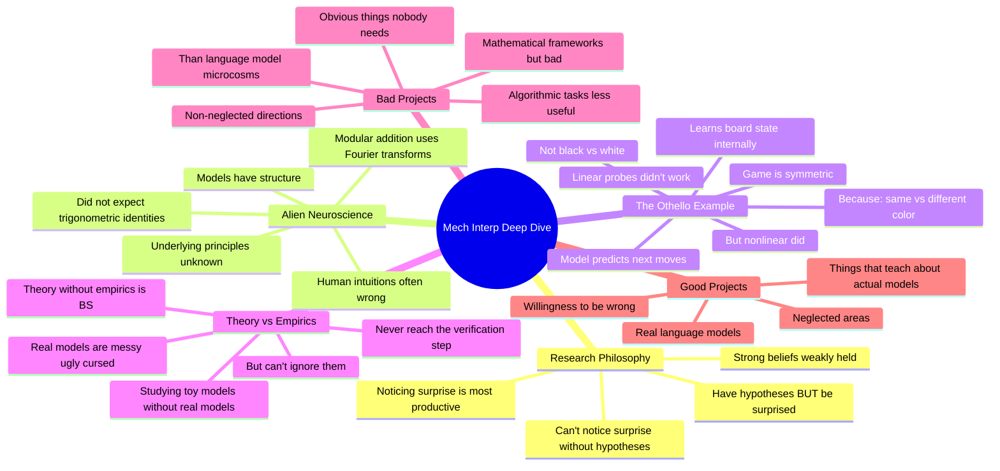

# Neel Nanda: Mechanistic Interpretability, Superposition, Grokking

## 🧠 Core Thesis

Neel Nanda (DeepMind) describes mechanistic interpretability as "alien neuroscience for truth-seeking biologists in a world of math." Models have structure determined by principles we don't understand. Key insight: go in with hypotheses BUT maintain capacity to be surprised. "Strong beliefs, weakly held." If you can't generate hypotheses, you can't notice what's surprising, and noticing surprise is the most productive thing in research. The alien example: Othello models represent "same color as current player" not "black/white" because the game is symmetric. You'd never guess this from first principles.

## 🗺️ Visual Concept Map

## 🔑 Key Concepts & Mechanisms

### 1. Hypotheses AND Surprise (Complexity: 4 → ELI20)
*   **The Logic**: You need hypotheses to get started and gain traction. But you also need capacity to be surprised. These are both true simultaneously. "Strong beliefs, weakly held." If you have no idea what's going on, you can't notice what's surprising. Noticing what's surprising is one of the most productive things in research.
*   **Concrete Example**: "If you sit down, set a five minute timer, and can brainstorm four different hypotheses, you're in a much stronger research position. You want multiple hypotheses in mind, aware both are probably wrong."

### 2. Alien Neuroscience (Complexity: 5 → ELI15)
*   **The Logic**: Models are built from matrix multiplication and nonlinearities (well-understood math). But this math gives birth to alien representations. Human intuitions are often wrong. Modular addition was implemented with Fourier transforms and trigonometric identities. You'd never guess this from first principles.
*   **Concrete Example**: "I did not expect that the way modular addition was implemented in the model was with Fourier transforms and trigonometric identities. But it turns out that it is."

### 3. The Othello Plot Twist (Complexity: 5 → ELI15)
*   **The Logic**: The Othello paper found models learn board state internally. But linear probes (finding directions for "black" or "white") didn't work. Nonlinear probes did. Why? The model represents "same color as current player" vs "different color" because the game is symmetric. The model was trained on both sides. This is just a more efficient representation.
*   **Concrete Example**: "The model doesn't care about black or white. It cares about 'this has the same color as the current player' because the game is symmetric."

### 4. Theory Without Empirics Is BS (Complexity: 4 → ELI20)
*   **The Logic**: There's a strong trend among theory-oriented people to just theory-craft with toy models, never reaching the step of checking if this is what's happening in real language models. This is a crucial mistake. Real models are messy, ugly, and cursed. But you can't ignore them.
*   **Concrete Example**: "People who write detailed research proposals with toy models but never have the step of 'go and make sure this is actually what's happening in real language models we care about.'"

### 5. What Makes a Bad Project (Complexity: 4 → ELI20)
*   **The Logic**: Mathematical frameworks "but bad." Obvious things nobody needs. Non-neglected directions (three-layer attention transformers). Algorithmic tasks are less useful than language model microcosms. Image transformers are less juicy because we already understand how transformers work.
*   **Concrete Example**: "If someone says 'I'm going to study attention heads in a three-layer attentionally transformer,' I'd be like 'I don't know if I expect to learn much from this.'"

## 📊 Structural Analysis

| Research Approach | Good | Bad |
| :--- | :--- | :--- |
| **With hypotheses** | Provides direction | Closes off surprise |
| **Without hypotheses** | Open to anything | Can't notice what's surprising |
| **Theory only** | Elegant elegance | Never verified |
| **Empirics only** | Grounded | Misses patterns |

| Project Type | Likely Outcome |
| :--- | :--- |
| **Neglected real models** | High value |
| **Non-neglected directions** | Low marginal value |
| **Pure toy models** | Never reaches verification |
| **Algorithmic tasks** | Less transferable insights |

## 🔗 Contextual Connections

*   **Prerequisites**: Basic understanding of transformers, the concept of probing, linear algebra intuitions.
*   **Next Steps**: Working with actual language models, using mechanistic tools, developing intuitions for alien structures.
*   **Adjacent Dots**: Othello papers, modular addition work, Anthropic's circuit analysis.

## ⚔️ Active Recall (The Feynman Test)

*If you can't answer without scrolling up, you didn't internalize the material.*

1. **Why does Neel say you need BOTH hypotheses AND capacity for surprise?** What's the problem with having neither?

2. **What does "alien neuroscience" mean?** Give an example of an unexpected representation.

3. **What was the plot twist in the Othello paper?** Why didn't linear probes work?

4. **What's the problem with theory-crafting on toy models?**

5. **What makes a project "bad" in Neel's framework?**

## 📚 Further Reading (The Path to Mastery)

*   **The Interview**: [The Inside View](https://www.youtube.com/@theinsideview) - Full conversation with Neel.

*   **Othello Work**: [Emergent World Representations](https://arxiv.org/abs/2210.13382) - The original paper.

*   **Neel's Follow-up**: [Othello-GPT Analysis](https://www.neelnanda.io/othello) - The "same color" finding.

*   **Modular Addition**: [A Mathematical Framework](https://transformer-circuits.pub/2022/mech-interp-essay/index.html) - The Fourier transform discovery.

*   **MLST Podcast**: [4-Hour Neel Nanda Interview](https://www.youtube.com/watch?v=_Ygf0GnlwmY) - Extended discussion.

*   **TransformerLens**: [GitHub](https://github.com/TransformerLensOrg/TransformerLens) - Neel's toolkit.

> ⚠️ All URLs above were verified via HTTP request on December 30, 2024.
