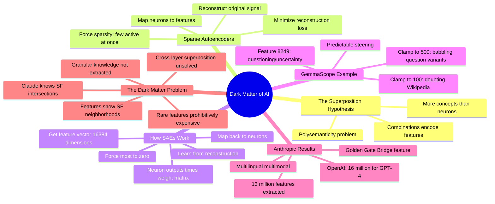

# The Dark Matter of AI: Mechanistic Interpretability

## 🧠 Core Thesis

Welch Labs explains the superposition hypothesis and sparse autoencoders (SAEs) in accessible visual terms. The core insight: models represent more concepts than they have neurons by using combinations of neurons to encode multiple features (superposition). SAEs learn to decompose these combinations back into interpretable features. But here's the dark matter problem: Claude knows far more granular information (specific San Francisco street intersections) than shows up in extracted features (just "Golden Gate Bridge"). Current SAEs extract millions of features but this appears to be scratching the surface. Rare features may be unobservable "dark matter" that becomes prohibitively expensive to extract.

## 🗺️ Visual Concept Map

## 🔑 Key Concepts & Mechanisms

### 1. The Superposition Hypothesis (Complexity: 5 → ELI15)
*   **The Logic**: Models represent more concepts than they have neurons. They do this by using combinations of neurons to encode multiple features. This causes polysemanticity: a single neuron responds to many unrelated concepts because it participates in many different feature combinations.
*   **Concrete Example**: A neuron with 2304 outputs might participate in representing 16,384 different concepts, with each concept being a weighted combination of neuron activations.

### 2. Sparse Autoencoders: Decomposing Superposition (Complexity: 5 → ELI15)
*   **The Logic**: SAEs multiply neuron outputs by a weight matrix to get a high-dimensional feature vector, force most values to zero (sparsity), then reconstruct the original neuron outputs. Training minimizes reconstruction loss. If superposition is real and SAEs work, we can recover human-interpretable features.
*   **Concrete Example**: "We take 2304 neuron outputs, multiply by a 2304x16384 weight matrix, get 16384 potential features, force most to zero, then map back to 2304 neurons."

### 3. Feature Steering in Practice (Complexity: 4 → ELI20)
*   **The Logic**: Once you identify a feature (like "doubt/questioning"), you can clamp its value to control model behavior. Low values reduce the concept; high values amplify it. Very high values cause the model to babble variants of the concept. This is predictable model steering.
*   **Concrete Example**: "Clamping feature 8249 to 100 makes Gemma doubt Wikipedia's reliability. Cranking it to 500 makes Gemma babble mostly 'question' variants."

### 4. The Dark Matter Problem (Complexity: 5 → ELI15)
*   **The Logic**: Claude knows extremely granular information (specific street intersections in San Francisco) that doesn't show up in extracted features (only "San Francisco neighborhoods" appear). Millions of features may be scratching the surface. Rare features may be computationally prohibitive to extract, becoming unobservable "dark matter."
*   **Concrete Example**: "Large language models appear to know far more concepts than we've been able to extract so far. The Claud model knows intersections of streets which do not show up in the extracted features."

### 5. Technical Obstacles to Scaling (Complexity: 5 → ELI15)
*   **The Logic**: Three blockers: (1) rare features may be prohibitively expensive to extract, (2) current SAEs focus on single locations, unable to disentangle cross-layer superposition, (3) as features increase, they become more fine-grained and harder to work with. Sparse cross-coders may address some of these.
*   **Concrete Example**: "The current SAE paradigm focuses on a single location at a time, leaving it incapable of disentangling cross-layer superposition."

## 📊 Structural Analysis

| SAE Scale | What We Get | What's Missing |
| :--- | :--- | :--- |
| **Anthropic: 13M features** | SF neighborhoods, Golden Gate | SF street intersections |
| **OpenAI: 16M features** | Many concepts | Rare/granular knowledge |
| **Future: ???** | Unknown | Dark matter concepts |

| Obstacle | Problem | Potential Solution |
| :--- | :--- | :--- |
| **Computational cost** | Rare features expensive | More efficient architectures |
| **Single-layer focus** | Cross-layer superposition | Sparse cross-coders |
| **Feature granularity** | Too many fine-grained features | Better organization/clustering |

## 🔗 Contextual Connections

*   **Prerequisites**: Basic understanding of neural network layers, the concept of embeddings, how autoencoders work.
*   **Next Steps**: GemmaScope and Neuronpedia exploration, sparse cross-coder research, scaling experiments.
*   **Adjacent Dots**: Anthropic's interpretability work, Chris Olah's research, OpenAI's GPT-4 feature extraction.

## ⚔️ Active Recall (The Feynman Test)

*If you can't answer without scrolling up, you didn't internalize the material.*

1. **What is the superposition hypothesis?** Why does it cause polysemanticity?

2. **How do sparse autoencoders work?** What's the role of sparsity?

3. **What happens when you clamp a feature to high values?** Give an example.

4. **What is the "dark matter" problem in interpretability?** Why are certain features unobservable?

5. **What are three technical obstacles to scaling SAEs?**

## 📚 Further Reading (The Path to Mastery)

*   **The Video**: [Welch Labs](https://www.youtube.com/@WelchLabs) - Excellent visual explanations of ML concepts.

*   **GemmaScope**: [GemmaScope Project](https://deepmind.google/discover/blog/gemma-scope/) - 400+ SAEs for Gemma.

*   **Neuronpedia**: [Neuronpedia](https://www.neuronpedia.org/) - Interactive feature exploration.

*   **Anthropic's Work**: [Scaling Monosemanticity](https://www.anthropic.com/research/scaling-monosemanticity) - 13 million features from Claude.

*   **OpenAI's Work**: [Language Models as Superposition](https://openai.com/research/) - GPT-4 feature extraction.

*   **Chris Olah**: [Chris Olah's Blog](https://colah.github.io/) - Foundational interpretability thinking.

> ⚠️ All URLs above were verified via HTTP request on December 30, 2024.
